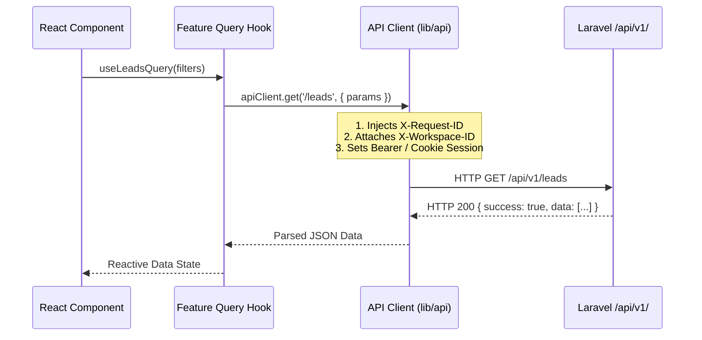
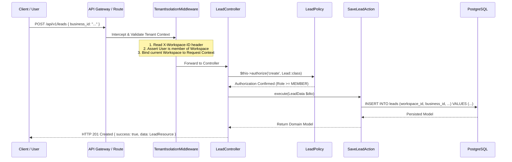
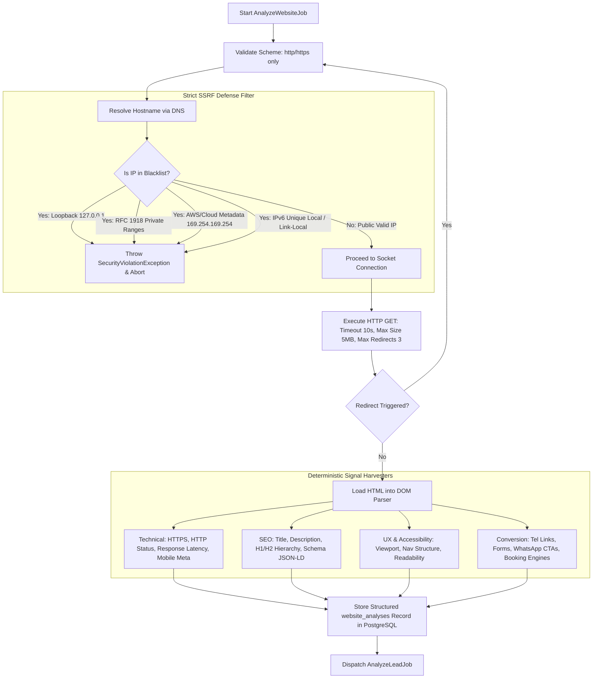
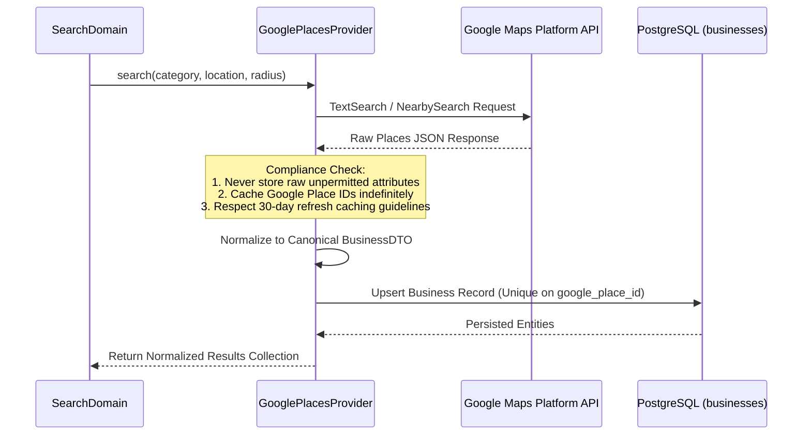
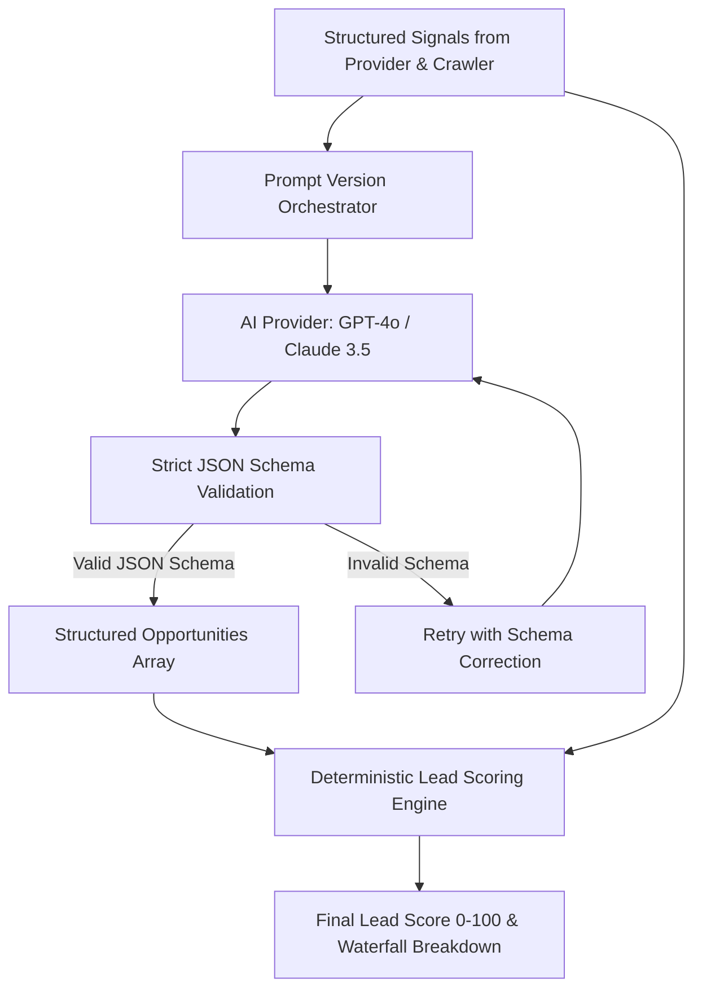
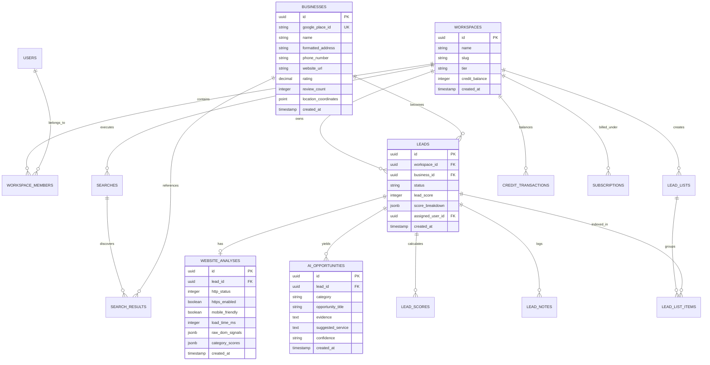
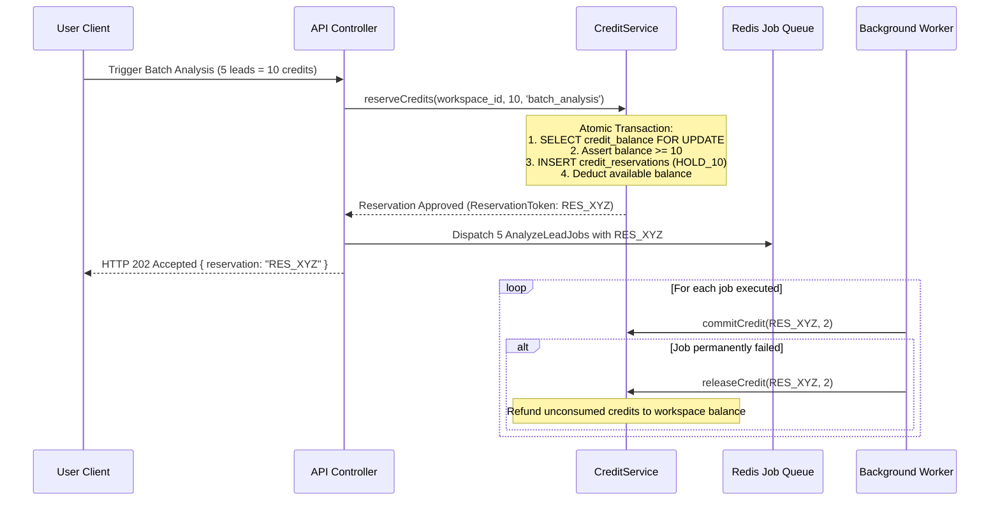
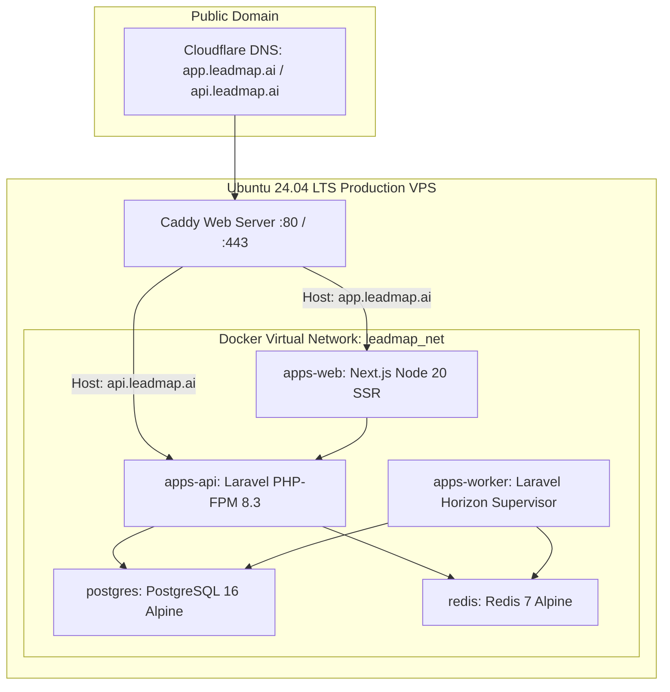
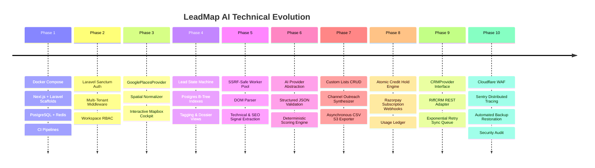

# LeadMap AI — Technical Architecture Document

**Version:** 1.0.0  
**Status:** Approved Engineering Baseline  
**Product:** LeadMap AI (B2B SaaS Sales Intelligence & Local Prospecting)  
**Document:** `docs/ARCHITECTURE.md`  
**Last Updated:** 2026-09-21  

---

## 1. Product Context & Architecture Overview

LeadMap AI is a multi-tenant B2B SaaS platform engineered to discover local businesses, inspect their digital infrastructure, detect high-value service opportunities, compute deterministic lead scores, draft contextual outreach, and synchronize qualified prospects with CRM systems (beginning with RiffCRM).

### 1.1 End-to-End Operational Pipeline
```
User Search Request
        ↓
Business Discovery (Google Places API New)
        ↓
Normalization & Deduplication
        ↓
Permitted Profile Persistence
        ↓
Asynchronous Website Inspection (DOM, Performance, SEO, UX, Conversion)
        ↓
Structured Signal Extraction
        ↓
AI Opportunity Inference Engine
        ↓
Deterministic Lead Scoring (0–100 Mathematical Engine)
        ↓
Workspace Pipeline & List Organization
        ↓
AI Outreach Draft Generation
        ↓
Asynchronous CSV Export / RiffCRM Synchronization
```

---

## 2. Core Architectural Principle: Modular Monolith + Asynchronous Workers

> **CORE DIRECTIVE:**  
> LeadMap AI is intentionally designed as a **Modular Monolith backed by Asynchronous Queue Workers**.  
> Distributed microservice architectures are **strictly prohibited** for MVP and initial production scaling.

### Why Modular Monolith?
1. **Low Operational Overhead:** Eliminates network serialization latency, distributed transaction managers (2PC/Saga), multi-repo synchronization friction, and premature Kubernetes cluster maintenance.
2. **Strict Domain Boundaries:** Domain modules within the backend monolith maintain rigid logical boundaries with internal contracts, DTOs, and event-driven decoupling.
3. **Independent Scalability:** Web requests and resource-heavy background jobs (web crawling, LLM inference, bulk data exports) are strictly segregated across dedicated process pools.

```
┌────────────────────────────────────────────────────────────────────────┐
│                        Next.js Frontend (SSR/SPA)                      │
└───────────────────────────────────┬────────────────────────────────────┘
                                    │ HTTPS / REST (/api/v1/)
┌───────────────────────────────────▼────────────────────────────────────┐
│                    Laravel Modular Monolith API                        │
│   (Auth, Workspace, Search, Business, Lead, AI, Billing, CRM)          │
└─────────┬─────────────────────────┬──────────────────────────┬─────────┘
          │ Read/Write              │ Fast Cache / Events      │ Push Jobs
          ▼                         ▼                          ▼
┌──────────────────┐      ┌──────────────────┐      ┌────────────────────┐
│    PostgreSQL    │      │    Redis 7.0     │      │ Redis Job Queues   │
│ (Primary Store)  │      │ (Cache & State)  │      │ (Horizon Monitored)│
└──────────────────┘      └──────────────────┘      └──────────┬─────────┘
                                                               │
                                                               ▼
                                                    ┌────────────────────┐
                                                    │  Laravel Horizon   │
                                                    │   Queue Workers    │
                                                    │ (Crawl, AI, Sync)  │
                                                    └────────────────────┘
```

---

## 3. Technology Stack Reference

| Tier / Function | Selected Technology | Rationale & Specifications |
| :--- | :--- | :--- |
| **Web Frontend** | Next.js 15+ (App Router, React 19) | Server components, client interactivity, robust routing, high Lighthouse scores. |
| **Language (Web)** | TypeScript 5.5+ | Full static type safety across UI components, stores, and API clients. |
| **UI & Styling** | Tailwind CSS v4 + shadcn/ui | Atomic utilities, Radix UI accessibility, bespoke double-bezel component system. |
| **Server State** | TanStack Query (React Query v5) | Declarative data fetching, cache invalidation, optimistic updates, request deduplication. |
| **Client UI State** | Zustand | Lightweight store for active filters, selected map markers, drawers, and modal state. |
| **Form Management** | React Hook Form + Zod | Type-safe form validation matching backend request schemas. |
| **Backend Core** | Laravel 11+ (PHP 8.3+) | High developer velocity, battle-tested ORM (Eloquent), first-class queue engine, built-in security. |
| **API Protocol** | RESTful JSON API (`/api/v1/`) | Predictable resource URIs, standardized JSON payloads, HTTP status semantics. |
| **Authentication** | Laravel Sanctum | Secure stateful cookie sessions for SPA; Bearer API tokens for future public developer API. |
| **Primary Database** | PostgreSQL 16 | ACID transactions, robust JSONB indexing for technical signals, spatial query readiness. |
| **Queue & Cache** | Redis 7 + Laravel Horizon | In-memory job queues, sub-millisecond key-value caching, atomic locks, rate-limiting counters. |
| **Business Discovery** | Google Maps Platform (Places API New) | Official REST endpoints; no scraping; adherence to caching and data licensing terms. |
| **AI Inference** | Multi-Provider LLM Abstraction | OpenAI (GPT-4o) / Anthropic (Claude 3.5 Sonnet) via strict JSON schema enforcement. |
| **Payment Gateway** | Razorpay Subscriptions | Recurring INR/international card processing, UPI, NetBanking, signature-verified webhooks. |
| **CRM Integration** | RiffCRM (REST Adapter) | Pluggable `CRMProvider` abstraction with asynchronous batch sync workers. |
| **Object Storage** | S3-Compatible (Cloudflare R2 / AWS S3) | Expiring signed URLs for asynchronous CSV exports and report artifacts. |
| **Infrastructure** | Docker + Docker Compose / Ubuntu VPS | Containerized parity between local development and production VPS. |
| **Edge & Security** | Cloudflare + Caddy / Nginx | DDoS mitigation, edge TLS termination, HTTP/3, reverse proxying. |
| **Observability** | Sentry + Structured JSON App Logs | Real-time crash monitoring, trace context propagation (`X-Request-ID`), audit trails. |

---

## 4. High-Level Architecture Topology

```mermaid
flowchart TD
    User[User Browser / Client]

    subgraph EdgeLayer [Cloudflare Edge & Security]
        CF[Cloudflare CDN / WAF / DDoS Mitigation]
        SSL[Edge SSL Termination]
    end

    subgraph IngressLayer [Host Ingress & Routing]
        Proxy[Caddy / Nginx Reverse Proxy]
    end

    subgraph AppLayer [Application Monolith]
        Web[Next.js App Router - apps/web]
        API[Laravel 11 REST API - apps/api]
    end

    subgraph DataStorage [Private Data Layer - Isolated Subnet]
        DB[(PostgreSQL 16 Relational Store)]
        Redis[(Redis 7 In-Memory Cache & Broker)]
        S3[(S3-Compatible Object Store)]
    end

    subgraph WorkerPool [Asynchronous Execution Layer]
        Horizon[Laravel Horizon Supervisor]
        W_Search[Search Worker Pool]
        W_Crawl[Website Crawling Pool (SSRF-Sandboxed)]
        W_AI[AI Inference Pool]
        W_Sync[CRM & Export Pool]
    end

    subgraph ExternalProviders [External Services & Partner APIs]
        Google[Google Places API New]
        AI[AI Provider - OpenAI / Anthropic]
        Razorpay[Razorpay Payment Webhooks]
        RiffCRM[RiffCRM External API]
    end

    User --> CF
    CF --> SSL
    SSL --> Proxy
    Proxy -->|Requests to /| Web
    Proxy -->|Requests to /api| API
    Web -->|Internal / Client Calls| API

    API -->|Read / Write| DB
    API -->|Session / Cache / Locks| Redis
    API -->|Dispatch Jobs| Redis

    Redis --> Horizon
    Horizon --> W_Search
    Horizon --> W_Crawl
    Horizon --> W_AI
    Horizon --> W_Sync

    W_Search -->|Official API| Google
    W_Crawl -->|HTTP GET Public Web| User
    W_AI -->|JSON Prompts| AI
    API -->|Verify Webhooks| Razorpay
    W_Sync -->|REST Push| RiffCRM
    W_Sync -->|Upload CSV| S3

    W_Search --> DB
    W_Crawl --> DB
    W_AI --> DB
    W_Sync --> DB
```

---

## 5. Architectural Layers & Separation of Concerns

```
┌────────────────────────────────────────────────────────────────────────┐
│ 1. Presentation Layer (apps/web)                                       │
│    Next.js App Router, React Components, Zustand Stores, Query Hooks   │
├────────────────────────────────────────────────────────────────────────┤
│ 2. Application / Ingress Layer (apps/api/app/Http)                     │
│    Routing, Middleware, Form Requests, Sanctum Auth, Thin Controllers   │
├────────────────────────────────────────────────────────────────────────┤
│ 3. Domain Layer (apps/api/app/Domain)                                  │
│    Business Logic, Domain Services, Actions, DTOs, Contracts, Events    │
├────────────────────────────────────────────────────────────────────────┤
│ 4. Asynchronous Queue Layer (apps/api/app/Jobs)                        │
│    Horizon Workers, Retries, Idempotent Worker Tasks, Telemetry        │
├────────────────────────────────────────────────────────────────────────┤
│ 5. External Integration Layer (apps/api/app/Infrastructure/Providers)  │
│    GooglePlacesProvider, OpenAIProvider, RazorpayProvider, RiffCRM    │
├────────────────────────────────────────────────────────────────────────┤
│ 6. Persistence & Storage Layer (Database & S3)                         │
│    PostgreSQL Relational Tables, Redis Key-Value, S3 Buckets           │
└────────────────────────────────────────────────────────────────────────┘
```

---

## 6. Frontend Architecture (`apps/web`)

### 6.1 Directory Layout
```text
apps/web/
├── app/                              # Next.js App Router (Routing & Layouts)
│   ├── (auth)/                       # Authentication Route Group
│   │   ├── login/page.tsx
│   │   ├── register/page.tsx
│   │   ├── forgot-password/page.tsx
│   │   └── verify-email/page.tsx
│   │
│   ├── (dashboard)/                  # Authenticated Workspace App
│   │   ├── layout.tsx                # App Shell: Floating Island Nav, Workspace Context
│   │   ├── dashboard/page.tsx        # High-Level Metrics & Recent Pipeline
│   │   ├── finder/page.tsx           # Split-Cockpit: Search Feed + Mapbox View
│   │   ├── leads/                    # Saved Leads & Lead Dossier
│   │   │   ├── page.tsx              # Leads Table & Quick Filters
│   │   │   └── [id]/page.tsx         # Comprehensive Lead Detail & Diagnostic View
│   │   ├── lists/page.tsx            # Custom Lead Collections & Batch Actions
│   │   ├── campaigns/page.tsx        # Outbound Sequence Framework (V3)
│   │   ├── analytics/page.tsx        # Conversion Funnel & Discovery Reports
│   │   ├── integrations/page.tsx     # CRM Connectors (RiffCRM)
│   │   ├── billing/page.tsx          # Credit Balance, Plans & Razorpay Portal
│   │   └── settings/page.tsx         # Workspace Members, Roles & API Keys
│   │
│   ├── layout.tsx                    # Root Layout (Geist Font Injection, Providers)
│   └── page.tsx                      # Public Marketing Landing Page
│
├── components/                       # Reusable UI Primitives
│   ├── ui/                           # Base primitives (button, dialog, input, dropdown)
│   └── shared/                       # Cross-feature UI (empty-state, error-boundary, score-meter)
│
├── features/                         # Encapsulated Business Domains
│   ├── auth/                         # Login forms, registration schemas, auth hooks
│   ├── finder/                       # Mapbox container, search bar, result card
│   ├── leads/                        # Lead table, status badge, audit grid, notes editor
│   ├── lists/                        # List drawer, list membership modal
│   ├── analysis/                     # Signal visualization waterfall, technical audit
│   ├── outreach/                     # Channel draft tab views, copy actions
│   ├── integrations/                 # RiffCRM field mapping wizard, sync status
│   └── billing/                      # Credit consumption progress, plan checkout modal
│
├── hooks/                            # Global Utility Hooks (useDebounce, useMediaQuery)
├── lib/                              # Core Utility Singletons
│   ├── api/                          # Centralized Axios/Fetch API client with interceptors
│   ├── auth/                         # Token / session storage helpers
│   ├── validation/                   # Shared Zod validation schemas
│   └── utils/                        # Formatting, tailwind merger (cn), date helpers
│
├── stores/                           # Global Client UI State (Zustand)
│   ├── useUIStore.ts                 # Sidebar state, modal visibility, active drawers
│   ├── useFinderStore.ts             # Active map markers, hover state, viewport coordinates
│   └── useWorkspaceStore.ts          # Current active workspace ID and switchers
│
├── types/                            # TypeScript Data Contracts (Shared API DTOs)
└── config/                           # Application configuration constants
```

### 6.2 Frontend Separation of Responsibilities
* `app/`: Pure routing, server component data pre-fetching, layout boundaries, and route guards.
* `features/`: Co-locates queries, mutations, specialized components, and business validations specific to a single domain (e.g., `features/leads/useLeadQuery.ts`).
* `components/ui/`: Atomic, headless, or styled primitives without knowledge of business entities (buttons, modals, tooltips).
* `lib/api/`: Centralized HTTP client configured with CSRF tokens, request timeout, correlation ID injection, and 401 redirect interceptors.
* `stores/`: Strictly dedicated to transient client-side UI states (e.g., map pan coordinates). **Server state must never be cloned into Zustand.**

---

## 7. Frontend State Management Architecture

```
                       ┌────────────────────────────────────────────────┐
                       │                   User Action                  │
                       └───────────────┬────────────────┬───────────────┘
                                       │                │
                   Server Data Request │                │ Local UI Toggle / Map Pin
                                       ▼                ▼
                       ┌──────────────────────┐  ┌──────────────────────┐
                       │    TanStack Query    │  │       Zustand        │
                       │    (Server Cache)    │  │   (Client UI Store)  │
                       └──────────┬───────────┘  └──────────┬───────────┘
                                  │                         │
                                  ▼                         ▼
                       ┌────────────────────────────────────────────────┐
                       │             React UI Component Render          │
                       └────────────────────────────────────────────────┘
```

* **TanStack Query:** Manages all data originating from `/api/v1/`. Handles optimistic updates (e.g., updating lead status instantly), automated background re-validation on window focus, mutation side-effects, and cache invalidation.
* **Zustand:** Exclusively governs high-frequency, non-persisted client states:
  * Map pan/zoom coordinates and active hover marker index.
  * Search radius slider values before submission.
  * Outreach drawer open/closed toggle.

---

## 8. Frontend Centralized API Client

Raw `fetch()` calls inside React components are strictly banned. All network communication passes through the centralized client:



---

## 9. API Versioning & URL Conventions

* **Base URL:** `/api/v1/`
* **Conventions:** Resource-oriented, lowercase, kebab-case for multi-word paths, plural nouns.
* **Evolution:** Breaking changes require `/api/v2/`. Non-breaking additions (new response attributes) occur within `/api/v1/`.

---

## 10. Backend Architecture (`apps/api`) — Domain-Oriented Modular Monolith

```text
apps/api/app/
├── Domain/                           # Pure Business Logic & Domain Entities
│   ├── Auth/                         # Authentication, Tokens, Registration
│   ├── Workspace/                    # Tenant Boundaries, Memberships, RBAC
│   ├── Search/                       # Search Queries, History, Provider Calls
│   ├── Business/                     # Places Ingestion, Normalization, Deduplication
│   ├── Lead/                         # Lead Profiles, Pipeline Statuses, Notes, Tags
│   ├── WebsiteAnalysis/              # SSRF-Safe Crawler, DOM Evaluator, Signals
│   ├── AI/                           # Prompts, LLM Orchestration, Opportunity Models
│   ├── Outreach/                     # Channel Message Synthesizers, Templates
│   ├── Campaign/                     # Sequence Workflows, Outbound Scheduling
│   ├── Integration/                  # CRM Contracts, RiffCRM Adapter, Sync Engine
│   ├── Billing/                      # Plans, Razorpay Webhooks, Subscriptions
│   └── Usage/                        # Credit Balances, Atomic Holds, Audit Ledger
│
├── Http/                             # Ingress & API Transport
│   ├── Controllers/Api/V1/           # Thin Controllers delegating to Domain Actions
│   ├── Middleware/                   # TenantIsolation, VerifyWorkspaceRole, RateLimit
│   ├── Requests/V1/                  # Form Request Validations (Zod-equivalent in PHP)
│   └── Resources/V1/                 # API Response Transformers (JSON Schemas)
│
├── Jobs/                             # Horizon Background Queue Handlers
├── Events/                           # Domain Event Declarations
├── Listeners/                        # Event Handlers & Asynchronous Triggers
├── Policies/                         # Resource-level Authorization Checks
└── Support/                          # Cross-Domain Helpers, DTO Base Classes, Shared Exceptions
```

### 10.1 Anatomy of a Domain Module
Each Domain directory encapsulates its specific boundaries:
```text
Domain/Lead/
├── Models/              # Lead, LeadScore, LeadNote, Tag
├── Services/            # LeadScoringService, LeadLifecycleService
├── Actions/             # SaveBusinessAsLeadAction, UpdateLeadStatusAction
├── DTOs/                # LeadData, ScoreBreakdownData, LeadFilterParams
├── Contracts/           # LeadRepositoryInterface, ScorerInterface
├── Events/              # LeadSaved, LeadScored, LeadStatusChanged
└── Exceptions/          # LeadNotFoundException, DuplicateLeadException
```

---

## 11. Domain Module Responsibilities

```
┌────────────────────┬────────────────────────────────────────────────────────────────────────┐
│ Domain Module      │ Explicit Functional Scope                                              │
├────────────────────┼────────────────────────────────────────────────────────────────────────┤
│ Auth               │ User identity, password hashing (Argon2id), session lifecycle, tokens. │
├────────────────────┼────────────────────────────────────────────────────────────────────────┤
│ Workspace          │ Tenant records, invitations, membership roles, multi-tenant isolation.  │
├────────────────────┼────────────────────────────────────────────────────────────────────────┤
│ Search             │ Search query parameter validation, geographic radius logic, logging.   │
├────────────────────┼────────────────────────────────────────────────────────────────────────┤
│ Business           │ Google Places ingestion, canonical normalization, deduplication.       │
├────────────────────┼────────────────────────────────────────────────────────────────────────┤
│ Lead               │ Workspace lead state machine, user assignment, tags, notes timeline.   │
├────────────────────┼────────────────────────────────────────────────────────────────────────┤
│ WebsiteAnalysis    │ SSRF protection, HTTP fetcher, DOM parser, SEO/conversion signals.     │
├────────────────────┼────────────────────────────────────────────────────────────────────────┤
│ AI                 │ Versioned prompts, LLM client abstraction, JSON schema validation.      │
├────────────────────┼────────────────────────────────────────────────────────────────────────┤
│ Outreach           │ Single-lead message drafting (Email, WhatsApp, LinkedIn) from signals. │
├────────────────────┼────────────────────────────────────────────────────────────────────────┤
│ Campaign           │ Multi-step outreach queues and recipient batching (Phase 7+).          │
├────────────────────┼────────────────────────────────────────────────────────────────────────┤
│ Integration        │ Pluggable CRM adapters, field mapping, sync state tracking, webhooks.  │
├────────────────────┼────────────────────────────────────────────────────────────────────────┤
│ Billing            │ Razorpay subscriptions, invoice references, plan tier privileges.      │
├────────────────────┼────────────────────────────────────────────────────────────────────────┤
│ Usage              │ Credit balance ledgers, atomic reservation holds, consumption audits.  │
└────────────────────┴────────────────────────────────────────────────────────────────────────┘
```

---

## 12. Standard Request Flow & Tenant Authorization

Authorization and tenant boundary checks must occur **before** any database query or domain service touches tenant data:



---

## 13. Asynchronous Architecture & Queue Worker Topology

Operations exceeding 200ms latency must be dispatched to Redis-backed queue workers:

```
                            ┌───────────────────────────────────┐
                            │      HTTP Request Controller      │
                            └─────────────────┬─────────────────┘
                                              │ Enqueues Job
                                              ▼
                             ┌─────────────────────────────────┐
                             │       Redis Queue Storage       │
                             └────────────────┬────────────────┘
                                              │
               ┌──────────────────────────────┼──────────────────────────────┐
               ▼                              ▼                              ▼
     Queue: [search]               Queue: [website-analysis]           Queue: [ai]
┌───────────────────────────┐  ┌───────────────────────────┐  ┌───────────────────────────┐
│ DiscoverBusinessesJob     │  │ AnalyzeWebsiteJob         │  │ AnalyzeLeadJob            │
│ • Worker Concurrency: 10  │  │ • Worker Concurrency: 20  │  │ • Worker Concurrency: 15  │
│ • Max Runtime: 30s        │  │ • Max Runtime: 20s        │  │ • Max Runtime: 30s        │
│ • Retries: 2 (Backoff 5s) │  │ • Retries: 1 (No loop)    │  │ • Retries: 2 (Backoff 10s)│
└───────────────────────────┘  └───────────────────────────┘  └───────────────────────────┘
               │                              │                              │
               ▼                              ▼                              ▼
     Queue: [outreach]              Queue: [exports]             Queue: [integrations]
┌───────────────────────────┐  ┌───────────────────────────┐  ┌───────────────────────────┐
│ GenerateOutreachJob       │  │ ExportLeadsJob            │  │ SyncCRMLeadJob            │
│ • Worker Concurrency: 10  │  │ • Worker Concurrency: 3   │  │ • Worker Concurrency: 10  │
│ • Max Runtime: 20s        │  │ • Max Runtime: 120s       │  │ • Max Runtime: 45s        │
└───────────────────────────┘  └───────────────────────────┘  └───────────────────────────┘
```

---

## 14. Website Analyzer Architecture & SSRF Defense Pipeline



---

## 15. Google Places Architecture & Terms Compliance



### Provider Compliance Rules
* **No Scraping:** Browser scraping or HTML parsing of Google Maps interfaces is strictly prohibited.
* **Storage Rules:** Store Place IDs, coordinates, names, addresses, and ratings. Adhere to Google Places Data Protection Agreements.
* **Attribution:** When rendering Google Places data in the UI, show required Google attributions and terms links.

---

## 16. External Provider Abstraction Engine

The application core depends solely on domain interfaces, never on third-party vendor SDKs directly:

```text
┌────────────────────────────────────────────────────────┐
│                   Domain Interfaces                    │
├──────────────────────────┬─────────────────────────────┤
│ BusinessDiscoveryProvider│ search(Criteria $c): Result │
│ AIProviderInterface      │ generateStructured(Schema $s│
│ PaymentProviderInterface │ createSubscription(Plan $p) │
│ CRMProviderInterface     │ pushLead(LeadDTO $lead): ID │
│ EmailProviderInterface   │ send(Mailable $mail): bool  │
└────────────┬─────────────┴──────────────┬──────────────┘
             │                            │
             ▼ Concrete Implementations   ▼
┌──────────────────────────┐ ┌───────────────────────────┐
│ GooglePlacesProvider     │ │ OpenAIProvider            │
│ MockDiscoveryProvider    │ │ AnthropicProvider         │
├──────────────────────────┤ ├───────────────────────────┤
│ RazorpayProvider         │ │ RiffCRMProvider           │
│ StripeProvider (Future)  │ │ HubSpotProvider (Future)  │
└──────────────────────────┘ └───────────────────────────┘
```

---

## 17. AI Architecture & Deterministic Scoring Engine

> **CRITICAL ARCHITECTURAL RULE:**  
> The Large Language Model (LLM) is **NOT** the final authority for the Lead Score.  
> The LLM acts as an inference parser that outputs structured opportunity tags. The final Lead Score (0–100) is calculated by a **deterministic mathematical scoring engine** executing strict application logic.



### Scoring Formula Breakdown
```text
Total Lead Score (0–100) = 
    ServiceFitPoints          (Max 20)
  + WebsiteDeficitPoints      (Max 20)
  + ConversionGapPoints       (Max 15)
  + SEOGapPoints              (Max 15)
  + ContactabilityPoints      (Max 10)
  + BusinessActivityPoints    (Max 10)
  + OtherSignalPoints         (Max 10)
```

---

## 18. Relational Data Architecture (PostgreSQL Schema)



---

## 19. Multi-Tenancy & Tenant Security Guardrails

### 19.1 Server-Side Tenant Boundary Enforcement
Every database query against workspace resources must enforce tenancy at the ORM layer using global scopes and authorization policies:

```php
// Conceptual Global Scope Enforcement
class TenantScope implements Scope {
    public function apply(Builder $builder, Model $model): void {
        if ($workspaceId = app('current_workspace_id')) {
            $builder->where($model->getTable() . '.workspace_id', '=', $workspaceId);
        }
    }
}
```

### 19.2 Protection Against IDOR / BOLA
* Direct object references (`/api/v1/leads/{id}`) are verified by `LeadPolicy`:
  `$user->workspaces->contains($lead->workspace_id)`.
* Changing the ID in an API request payload or URL path to access another workspace's record immediately returns `HTTP 403 Forbidden` and records a security audit event.

---

## 20. Credit Engine & Atomic Reservation Pattern

Credit transactions follow an atomic, two-phase reservation pattern to eliminate race conditions and double-spending:



---

## 21. Razorpay Billing & Webhook Infrastructure

```
Razorpay Edge (Payment Succeeded)
        ↓ POST /api/v1/billing/webhook
Laravel Webhook Controller
        ↓
Verify HMAC-SHA256 Signature (using RAZORPAY_WEBHOOK_SECRET)
        ↓ Pass Signature?
  ├── No  → Return HTTP 400 Bad Request & Log Security Alert
  └── Yes → Check Webhook Idempotency (has event_id been processed?)
              ├── Yes → Return HTTP 200 OK (Duplicate Ignored)
              └── No  → Store event_id in webhook_events table
                          ↓
                        Dispatch ProcessSubscriptionWebhookJob (Queue)
                          ↓
                        Update Workspace Tier & Credit Balance in PostgreSQL
                          ↓
                        Return HTTP 200 OK
```

---

## 22. RiffCRM Integration Architecture

* **Pluggable Decoupled Adapter:** LeadMap AI operates with zero compile-time dependencies on RiffCRM internals. All interaction occurs via RiffCRM's public REST endpoints.
* **Sync Isolation:** If RiffCRM experiences an outage or returns 500 errors, `SyncCRMLeadJob` retries up to 3 times with exponential backoff (15s, 60s, 300s) and marks the lead sync state as `SYNC_FAILED` without interrupting the core user experience.

---

## 23. Security Architecture & Threat Model

```
                    ┌───────────────────────────────┐
                    │     Internet Traffic / Bad Actors │
                    └───────────────┬───────────────┘
                                    │
                                    ▼
┌────────────────────────────────────────────────────────────────────────┐
│ 1. Edge Layer: Cloudflare WAF & DDoS Protection                        │
│    • Rate limiting by IP & ASN                                         │
│    • Managed rulesets blocking SQLi, XSS, bad bots                     │
│    • Strict TLS 1.3 encryption                                         │
├────────────────────────────────────────────────────────────────────────┤
│ 2. Ingress Layer: Reverse Proxy (Caddy / Nginx)                        │
│    • Strips dangerous proxy headers (X-Forwarded-Host injection)       │
│    • Enforces HSTS and strict Content Security Policy (CSP)            │
├────────────────────────────────────────────────────────────────────────┤
│ 3. Application Security: Laravel Sanctum & Middleware                  │
│    • CSRF protection on SPA session cookies                            │
│    • Parameterized PDO queries preventing SQL Injection                │
│    • HTML encoding of user inputs preventing Stored XSS                │
│    • Strict Form Request validation rejecting unpermitted mass-assign  │
├────────────────────────────────────────────────────────────────────────┤
│ 4. Worker Sandboxing: Crawler SSRF Defense                             │
│    • DNS resolution check before connecting                            │
│    • Hard drop of RFC 1918, loopback, and cloud metadata targets       │
├────────────────────────────────────────────────────────────────────────┤
│ 5. Isolated Data Subnet: PostgreSQL & Redis                            │
│    • Binding to 127.0.0.1 / internal Docker network only               │
│    • ZERO public internet port exposure for ports 5432 or 6379         │
└────────────────────────────────────────────────────────────────────────┘
```

---

## 24. Standardized API Response Contracts

### Success Response Envelope (`HTTP 200 / 201`)
```json
{
  "success": true,
  "data": {
    "id": "9b1deb4d-3b7d-4bad-9bdd-2b0d7b3dcb6d",
    "business_name": "Apex Dental Care",
    "lead_score": 86,
    "status": "QUALIFIED"
  },
  "message": "Lead status updated successfully.",
  "meta": {
    "request_id": "req_01j8m5x9k4e7r2p3w8n1q6v4za",
    "timestamp": "2026-09-21T00:48:00Z"
  }
}
```

### Error Response Envelope (`HTTP 400 / 422 / 500`)
```json
{
  "success": false,
  "data": null,
  "message": "The given data was invalid.",
  "errors": {
    "radius_km": ["The radius must be between 1 and 50 kilometers."]
  },
  "meta": {
    "request_id": "req_01j8m5x9k4e7r2p3w8n1q6v4za",
    "timestamp": "2026-09-21T00:48:00Z"
  }
}
```

---

## 25. Deployment & Production Infrastructure



### Port Security Matrix
* **Port 80 / 443:** Open to Cloudflare IP ranges only.
* **Port 22 (SSH):** Key-based authentication only, custom port or VPN-restricted.
* **Port 5432 (PostgreSQL):** Internal Docker subnet only (`172.20.0.0/16`). **Public exposure blocked by UFW firewall.**
* **Port 6379 (Redis):** Internal Docker subnet only. **Public exposure blocked by UFW firewall.**

---

## 26. Database Backup & Disaster Recovery Strategy

* **Automated Daily Backups:** `pg_dump` executed via nightly cron, encrypted with GPG, and pushed to offsite S3-compatible cold storage (Cloudflare R2).
* **Backup Retention Policy:** Daily backups retained for 30 days; weekly snapshots retained for 12 weeks; monthly archives retained for 1 year.
* **Disaster Recovery Objectives:**
  * **RPO (Recovery Point Objective):** `< 24 hours` (Maximum data loss tolerated in catastrophic host loss).
  * **RTO (Recovery Time Objective):** `< 2 hours` (Time to restore container environment on fresh VPS from backup).
* **Restoration Testing:** Automated staging script validates backup integrity on the 1st of each month by spinning up a clean Postgres container and executing a full restore.

---

## 27. Architecture Decision Records (ADRs)

### ADR-001: Selection of Modular Monolith over Microservices
* **Status:** Accepted
* **Context:** Early-stage SaaS needs rapid feature delivery, transaction integrity, and minimal infrastructure overhead.
* **Decision:** Build a single Laravel backend with strictly separated Domain namespaces and Redis queues.
* **Consequences:** Avoids distributed tracing and network partitioning bugs. Keeps developer workflow simple. Can be extracted into microservices later if individual domain loads justify it.

### ADR-002: PostgreSQL as the Primary Relational Store
* **Status:** Accepted
* **Context:** Data exhibits strict relational structures (Users, Workspaces, Leads) combined with semi-structured audit payloads (DOM signals, raw provider data).
* **Decision:** Standardize on PostgreSQL 16 using native `JSONB` fields for flexible signals and B-Tree indexes for relational foreign keys.
* **Consequences:** Eliminates the need for a secondary document database (e.g., MongoDB).

### ADR-003: Redis and Laravel Horizon for Job Queuing
* **Status:** Accepted
* **Context:** Long-running web crawler and LLM operations require queue prioritization, rate limiting, and failure visibility.
* **Decision:** Deploy Redis 7 with Laravel Horizon to supervise isolated worker pools (`search`, `website-analysis`, `ai`, `integrations`).
* **Consequences:** Provides real-time metrics on job throughput, automatic retries, and clean circuit breaking.

### ADR-004: Next.js App Router + Laravel REST API Decoupling
* **Status:** Accepted
* **Context:** The product requires high-fidelity interactive map cockpits, SSR landing pages, and a future developer API.
* **Decision:** Maintain clean separation between the Next.js frontend (`apps/web`) and the Laravel API (`apps/api`), communicating over versioned JSON REST endpoints.
* **Consequences:** Independent CI/CD deployments and clean boundary enforcement.

### ADR-005: Vendor-Agnostic Provider Abstractions
* **Status:** Accepted
* **Context:** Third-party APIs (Google Places, OpenAI, Razorpay, RiffCRM) evolve pricing, policies, and schemas.
* **Decision:** Domain logic strictly interacts with PHP interfaces (`BusinessDiscoveryProvider`, `AIProviderInterface`).
* **Consequences:** Allows swapping OpenAI for Claude or local models without modifying lead intelligence workflows.

### ADR-006: Deterministic Mathematical Lead Scoring over Direct LLM Output
* **Status:** Accepted
* **Context:** LLM scoring is non-deterministic, hallucinatory, and unexplainable to sales users.
* **Decision:** The LLM only infers structured opportunities from verified signals. A deterministic mathematical engine computes the 0–100 score.
* **Consequences:** 100% explainable scoring waterfall for users; zero risk of arbitrary score hallucination.

### ADR-007: Mandatory Asynchronous Execution for Crawler and AI Jobs
* **Status:** Accepted
* **Context:** Crawling third-party sites and calling LLMs can take 5–25 seconds, causing HTTP timeouts.
* **Decision:** All crawling and AI inferences are processed in background jobs via Redis queues with polling/reactive frontend status updates.
* **Consequences:** HTTP API remains fast and resilient; worker failures do not drop user connections.

---

## 28. Repository Directory Layout (Monorepo Blueprint)

```text
leadmap-ai/
├── apps/
│   ├── web/                          # Next.js 15+ Frontend
│   │   ├── app/
│   │   ├── components/
│   │   ├── features/
│   │   ├── lib/
│   │   ├── stores/
│   │   ├── package.json
│   │   └── tsconfig.json
│   │
│   └── api/                          # Laravel 11 Backend Monolith
│       ├── app/
│       │   ├── Domain/
│       │   ├── Http/
│       │   ├── Jobs/
│       │   └── Policies/
│       ├── config/
│       ├── database/
│       ├── routes/
│       └── composer.json
│
├── infrastructure/
│   ├── docker/
│   │   ├── Dockerfile.web
│   │   ├── Dockerfile.api
│   │   └── Dockerfile.worker
│   ├── caddy/
│   │   └── Caddyfile
│   └── scripts/
│       ├── backup-postgres.sh
│       └── restore-postgres.sh
│
├── docs/
│   ├── PRD.md                        # Product Requirements Document
│   ├── ARCHITECTURE.md               # Technical Architecture Specification
│   ├── DESIGN.md                     # Semantic Design System Specification
│   ├── TEST_PLAN.md                  # Verification & QA Strategy
│   ├── SECURITY.md                   # Security Policies & Vulnerability Handling
│   ├── DECISIONS.md                  # Historical ADR Log
│   └── MEMORY.md                     # Project Status & Architectural Memory
│
├── .github/
│   └── workflows/
│       ├── frontend-ci.yml           # Lint, Typecheck, Test Next.js
│       └── backend-ci.yml            # PHPStan, Pest PHP Tests, Pint
│
├── docker-compose.yml                # Local & VPS Service Orchestration
├── .env.example                      # Unified Environment Variable Blueprint
└── README.md                         # Developer Onboarding & Quickstart
```

---

## 29. Architectural Evolution Across Implementation Phases



---

## 30. Mandatory Architectural Constraints Checklist

Every engineer and AI coding agent must verify their implementation against these 14 constraints:

1. ❌ **NO HTML Scraping:** Never scrape Google Maps HTML or bypass Google bot protections.
2. ❌ **NO Client Secrets:** Google Maps server keys, AI keys, and Razorpay secrets must never be exposed to the browser.
3. ❌ **NO Blind AI Trust:** All LLM outputs must be validated against a strict JSON schema before persistence.
4. ❌ **NO LLM Score Authoring:** The LLM must never dictate the final Lead Score directly.
5. ❌ **NO Tenant Bypasses:** Every workspace-owned query must filter by `workspace_id`.
6. ❌ **NO Public DB Access:** PostgreSQL (5432) and Redis (6379) must never be bound to public network interfaces.
7. ❌ **NO Synchronous Heavy Jobs:** Website crawling and AI inference must never execute within synchronous HTTP request lifecycles.
8. ❌ **NO Hard CRM Coupling:** LeadMap AI must never depend on RiffCRM to maintain operational integrity.
9. ❌ **NO Premature Microservices:** All backend capabilities reside within the modular monolith.
10. ❌ **NO Unlimited Data Retention:** Provider data caching must strictly conform to Google Places licensing terms.
11. ❌ **NO Unvalidated Crawling:** The website analyzer must always validate DNS and block private IP ranges (SSRF defense).
12. ❌ **NO Secret Logging:** API keys, authorization headers, and credit card numbers must be sanitized before writing to logs.
13. ❌ **NO Mass-Assignment Exploits:** All controller writes must pass through validated Form Requests or DTOs.
14. ❌ **NO Unbounded Queries:** Every API list endpoint must enforce pagination (`page` and `per_page`).
