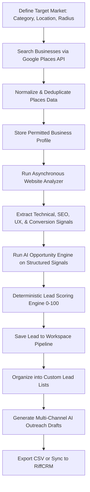
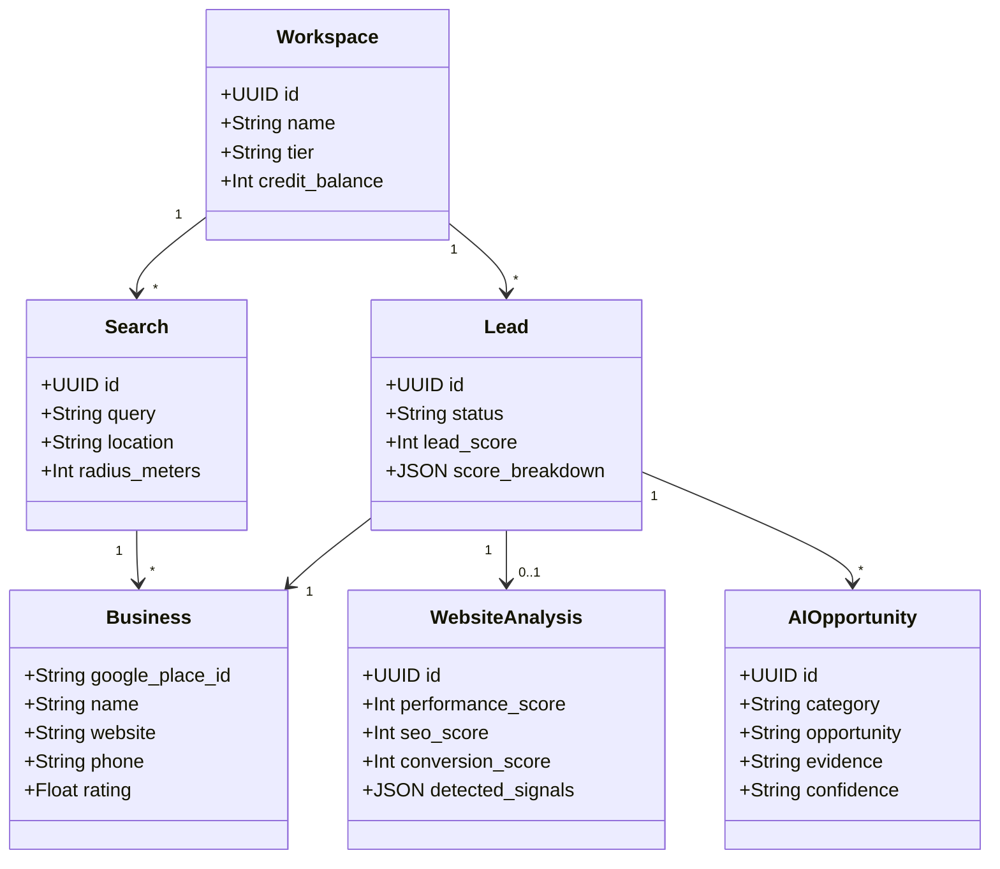
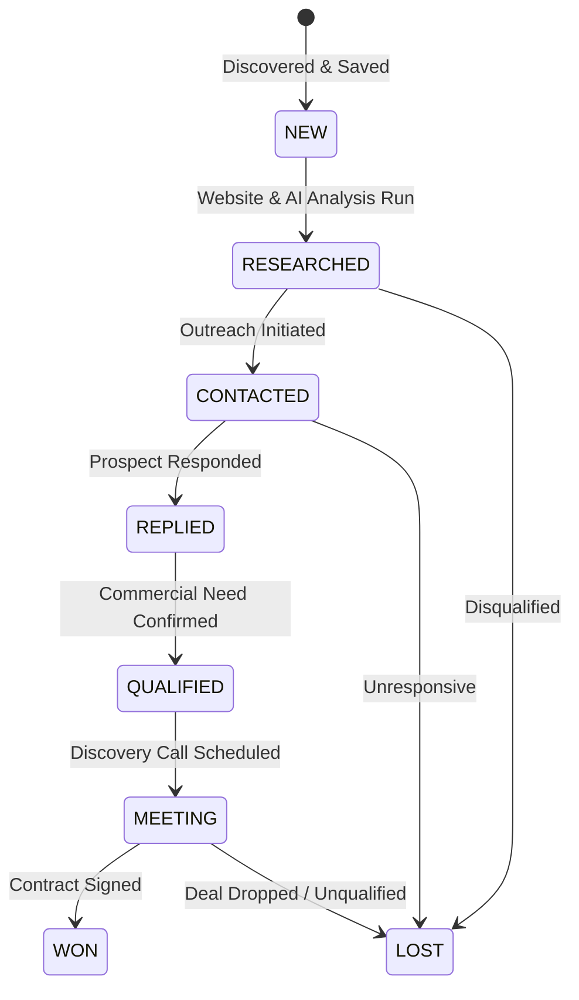
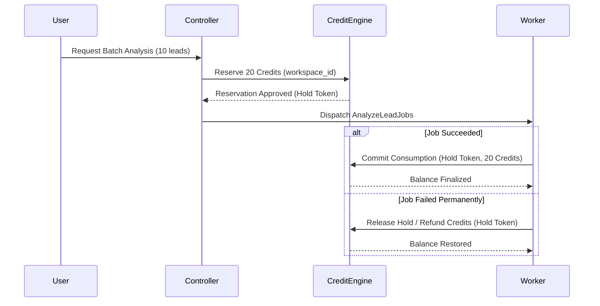

# LeadMap AI — Product Requirements Document

**Version:** 1.0.0  
**Status:** Draft / Development Baseline  
**Product:** LeadMap AI  
**Document Type:** Product Requirements Document (PRD)  
**Last Updated:** 2026-09-21  

---

## Executive Summary

**LeadMap AI** is a multi-tenant B2B SaaS platform designed to transform local business discovery and sales intelligence for digital agencies, freelancers, B2B sales teams, and consultants. Instead of relying on static, stale business directories or fragile scrapers, LeadMap AI leverages supported provider APIs (Google Maps Platform / Places API) coupled with deterministic website inspection and an AI Opportunity Engine.

The platform enables users to discover local businesses across specific geographic radii, evaluate their publicly accessible web footprint, identify high-value service opportunities (such as missing conversion flows, SEO deficiencies, performance bottlenecks, or absent booking systems), compute an explainable lead score (0–100), draft contextualized outreach messages, and synchronize qualified prospects into CRMs (starting with RiffCRM).

---

## 1. Product Information & Positioning

### 1.1 Product Metadata
* **Product Name:** LeadMap AI
* **Product Category:** B2B SaaS / Local Business Lead Generation / Sales Intelligence / AI Prospecting
* **Tagline:** *Turn local businesses into qualified opportunities.*

### 1.2 Core Product Concept
LeadMap AI bridges the gap between raw business listings and actionable sales pipeline development:

```
Business Discovery (Google Places API)
             +
Website Intelligence (Automated Inspection)
             +
AI Opportunity Detection (Inference Engine)
             +
Deterministic Lead Scoring (0–100 Explainable Score)
             +
Lead Pipeline & List Management
             +
AI-Assisted Contextual Outreach
             +
CRM Synchronization (RiffCRM & Standards)
```

### 1.3 Strict Legal & Compliance Positioning
> **CRITICAL COMPLIANCE NOTICE:**  
> LeadMap AI is strictly positioned as a **Sales Intelligence and Legitimate Discovery Platform**, **NOT** a "Google Maps scraper".

1. **No Scraping:** The platform strictly forbids and does not include Google Maps HTML scraping, headless browser emulation to bypass Google bot checks, CAPTCHA bypass techniques, or calls to undocumented/internal Google endpoints.
2. **Supported APIs Only:** All location and business place discovery must consume official, supported APIs (e.g., Google Maps Platform / Places API (New)).
3. **Data Protection & Terms Compliance:** All external data collection, storage, caching, and display must comply with applicable provider terms of service, developer policies, intellectual property rights, data caching time limits (e.g., Google Places caching policies), and relevant data privacy legislation (GDPR, CCPA, etc.).
4. **Public Data Scope:** Inspection is strictly limited to publicly reachable websites and explicitly disclosed business contact touchpoints. Private or credentialed data extraction is completely out of scope.

---

## 2. Product Vision & Problem Statement

### 2.1 Product Vision
To establish the industry standard in observable sales intelligence. LeadMap AI moves beyond simple directories to answer the core commercial question:

> *"Which local businesses are most likely to need the exact digital and operational services I provide, and what is the concrete evidence?"*

### 2.2 Problem Statement

Digital agencies, freelancers, and B2B professionals face structural inefficiencies when prospecting local markets:

* **Digital Agencies:** Web design, SEO, digital marketing, custom software, ERP/CRM, and automation agencies waste 15–20 hours per week manually searching Google, clicking through broken websites, running ad-hoc Lighthouse audits, and guessing which companies have budget and technical deficits.
* **Freelancers:** Solo service providers lack dedicated SDRs. Manually vetting 100 dental clinics or restaurants in a target city takes multiple days of repetitive research with inconsistent outcomes.
* **B2B Sales Teams:** Outbound sales reps struggle with prioritization. Cold lead lists lack observable pain points, leading to generic "spray and pray" messaging with sub-1% response rates.
* **Consultants:** Business consultants need to identify firms with specific operational lags (e.g., missing booking engines, no instant messaging touchpoints, archaic customer inquiry capture) before initiating dialogue.

#### The Failure of Manual Prospecting
* **Slow & Repetitive:** Reps spend 80% of their prospecting time gathering baseline facts rather than engaging prospects.
* **Inconsistent & Subjective:** Different reps evaluate websites against conflicting criteria without standardized qualification metrics.
* **Difficult to Scale:** Manual browsing cannot evaluate 500 businesses in an afternoon or systematically compare digital maturity across geographic clusters.
* **Low Context Outreach:** Without structured technical evidence, outreach emails default to generic templates that trigger spam filters and damage sender reputation.

---

## 3. Product Solution & End-to-End Workflow

LeadMap AI solves these bottlenecks through an automated, evidence-based pipeline:



---

## 4. Target Personas & Use Cases

### 4.1 Target Personas

| Persona | Role & Organization | Primary Objectives | Core Pain Points |
| :--- | :--- | :--- | :--- |
| **1. Digital Agency Owner** | Founder / Managing Director, 5–25 person web/marketing agency | Fill agency pipeline with web redesign, SEO, and paid media clients. | Spending hundreds of dollars on generic list vendors; reps wasting hours manual checking websites. |
| **2. Solo Freelancer** | Independent Web Developer / Designer / SEO Specialist | Secure 2–4 high-ticket local retainers each month. | Cannot afford expensive enterprise intelligence tools; lacks time for multi-step manual qualification. |
| **3. B2B Sales Representative** | Outbound SDR / BDR in B2B Tech / Merchant Services | Hit weekly booked meeting quotas with qualified local business operators. | Inability to quickly prioritize daily call lists by probability to close; lack of conversational icebreakers. |
| **4. SaaS Sales Team** | Commercial team selling vertical SaaS (e.g., salon booking, restaurant table mgmt) | Target businesses that lack modern vertical software capabilities. | Identifying niche technical deficiencies (e.g., no online reservation engine) at scale across regions. |
| **5. Operations / Tech Consultant** | Digital Transformation Consultant | Identify legacy operational workflows that require automation, CRM, or WhatsApp integrations. | Lack of structured signals regarding how small businesses capture customer inquiries online. |
| **6. Agency Sales Manager** | Head of Sales overseeing 4–10 SDRs | Maintain lead quality control, distribute lead lists, prevent territory collisions, monitor outbound volume. | Reps contacting the same businesses; duplicate outreach; no shared historical tracking. |

### 4.2 Detailed Use Cases

* **Use Case 1 (Web Redesign & Conversion Optimization):** An agency owner in Ahmedabad searches for *"Dentists in Ahmedabad"* within a 15 km radius. The system flags 35 clinics with active websites that lack responsive viewport configurations, have poor page load metrics, and lack an instant booking widget. The owner saves these into a "Dental Redesign Targets" list.
* **Use Case 2 (Vertical Booking Systems):** A SaaS company selling restaurant reservation software filters search results for *"Fine Dining in Mumbai"* where `booking_detected == false` and reviews are > 100. They immediately identify high-traffic venues relying on manual telephone bookings.
* **Use Case 3 (Local SEO & Content Retainers):** An SEO freelancer searches for *"Plumbing Contractors in Chicago"*, filtering by businesses with high ratings (> 4.5) but missing meta descriptions, absent Open Graph tags, and missing schema markup.
* **Use Case 4 (WhatsApp Conversational Commerce):** A marketing consultant identifies retail shops in Bangalore that list a mobile phone number but have no WhatsApp click-to-chat integration on their mobile landing page.
* **Use Case 5 (Prioritized High-Yield Pipeline):** A B2B rep reviews 200 discovered businesses sorted by Lead Score (85+), filtering out unverified contact methods, and targets the top 20 prospects each morning.
* **Use Case 6 (Hyper-Contextual Outreach Drafting):** A sales rep selects a high-score clinic and triggers AI Outreach for "Email". The AI produces a draft citing the clinic's 4.8-star reputation alongside the specific absence of an online scheduling flow.
* **Use Case 7 (Audited CSV Data Export):** An SDR exports 100 qualified prospects with business name, address, verified phone number, website, calculated Lead Score, and key opportunities to CSV for dialer import.
* **Use Case 8 (Direct CRM Pipe):** A user clicks "Sync to RiffCRM" on a batch of 15 validated leads. The leads appear in RiffCRM mapped to Companies and Contacts with opportunity tags and lead scores intact.

---

## 5. Product Principles & Data Classification

### 5.1 Guiding Principles
1. **Evidence First:** Observable data and measured technical attributes always take precedence over assumptions.
2. **AI Assists, Humans Decide:** AI generates diagnostic insights, hypotheses, and message drafts; human sales professionals evaluate fit and initiate communications.
3. **Transparent Explainability:** Every lead score and AI recommendation must present its underlying signals and reasoning. No black-box scores.
4. **Provider Compliance & Ethics:** Zero scraping. Adherence to official API terms, rate limits, caching rules, and privacy laws.
5. **Strict Multi-Tenancy:** Absolute tenant data isolation across all storage, queues, caches, and search indices.
6. **Production Reliability:** Long-running web crawler and LLM operations must always run asynchronously via resilient queues with idempotency.

### 5.2 Four-Tier Data Classification System
To ensure honesty and avoid misleading users, every data attribute in the UI and API must carry an explicit classification:

```
┌─────────────────────────┬────────────────────────────────────────────────────────┐
│ Classification          │ Definition & Origin                                    │
├─────────────────────────┼────────────────────────────────────────────────────────┤
│ 1. Provider Data        │ Raw data returned directly from Google Places API      │
│                         │ (e.g., Place Name, Geometry, Ratings, Opening Hours).  │
├─────────────────────────┼────────────────────────────────────────────────────────┤
│ 2. Observed Data        │ Verifiable technical facts inspected directly on the   │
│                         │ public website (e.g., HTTP status, SSL, Title, CMS).   │
├─────────────────────────┼────────────────────────────────────────────────────────┤
│ 3. Derived Data         │ Deterministic calculations executed by LeadMap code    │
│                         │ (e.g., Performance score 0-100, Lead Score 0-100).     │
├─────────────────────────┼────────────────────────────────────────────────────────┤
│ 4. AI Inference         │ Probabilistic insights, opportunity categories, and    │
│                         │ outreach copy generated by an LLM based on signals.    │
└─────────────────────────┴────────────────────────────────────────────────────────┘
```

---

## 6. Phased Scope & Product Roadmap

```
MVP (Phase 1-6)    ──> V2 (Phase 7-9)    ──> V3 (Phase 10-12)  ──> V4 / Enterprise
• Auth & Workspace     • Lead Lists          • Campaigns           • Agency White-Label
• Google Places        • Advanced Filters    • Email Sequences     • Custom Scoring Rules
• Website Analyzer     • AI Outreach Drafts  • Webhooks            • Custom AI Prompts
• Deterministic Score  • CSV Export          • Multi-CRM Adapters  • Full Public API
• Basic Lead Mgmt      • Razorpay Billing    • Team Collaboration  • SSO & Dedicated Infra
• Single Lead Profile  • RiffCRM Direct Sync • Real-Time Alerts    • Multi-Level Teams
```

### 6.1 Feature Scope Matrix

| Module / Capability | MVP | V2 | V3 | V4 / Enterprise |
| :--- | :---: | :---: | :---: | :---: |
| Multi-Tenant Workspaces (Owner, Member) | Yes | Enhanced | Roles/Perms | Custom Roles |
| Google Places (Official API) Discovery | Yes | Yes | Yes | Yes |
| Map & Synchronized Results List | Yes | Yes | Yes | Yes |
| Asynchronous Website Analyzer | Yes | Yes | Yes | Multi-Page Deep Crawl |
| AI Opportunity Detection (Structured) | Yes | Yes | Advanced Prompts | Custom Prompt Studio |
| Deterministic Lead Scoring (0–100) | Yes | Yes | Tunable Weights | Custom Rule Builder |
| Basic Lead Management (Save, Notes) | Yes | Yes | Yes | Yes |
| Custom Lead Lists & Bulk Organization | No | Yes | Yes | Yes |
| AI Outreach Message Drafts (Single) | No | Yes | Templates | Dynamic Playbooks |
| Outbound Campaign Execution | No | No | Yes | Yes |
| CSV Data Export | No | Yes | Scheduled | Enterprise Audit Export |
| Usage Credit Engine | Basic | Yes (Enforced) | Tiered Rollover | Custom Quotas |
| Razorpay Subscription Billing | No | Yes | Multi-Currency | Invoiced Billing |
| RiffCRM Direct Integration | No | Yes | Bi-Directional | Bi-Directional |
| Multi-CRM (HubSpot, Salesforce, Pipedrive)| No | No | Yes | Custom Webhook CRM |
| Public Developer API & Webhooks | No | No | Yes | High-Throughput SLA |
| White-Labeling & Custom Domains | No | No | No | Yes |

---

## 7. Multi-Tenancy & Workspace System

LeadMap AI enforces a rigid multi-tenant boundary. All operational records (leads, searches, lists, credits, integrations) belong to a `Workspace`.

```
                    ┌──────────────┐
                    │     User     │
                    └──────┬───────┘
                           │ (M:N via WorkspaceMember)
             ┌─────────────┴─────────────┐
             ▼                           ▼
    ┌─────────────────┐         ┌─────────────────┐
    │  Workspace A    │         │  Workspace B    │
    │  (Role: OWNER)  │         │  (Role: VIEWER) │
    └────────┬────────┘         └────────┬────────┘
             │                           │
    ┌────────┴───────────────────────────┴────────┐
    ▼                                             ▼
Isolated Searches, Leads, Lists, Credits, Integrations, Audit Logs
```

### 7.1 Multi-Tenant Rules
1. **Tenant Isolation:** Every database query targeting workspace resources must include `WHERE workspace_id = :current_workspace_id`. Cross-tenant data leakage is a critical P0 security failure.
2. **Context Switching:** Users can belong to multiple Workspaces. An active workspace context is maintained via session / JWT claims and validated on every API call.
3. **Billing Boundary:** Credit balances and subscription tiers attach to the `Workspace`, not the individual `User`.

### 7.2 Role-Based Access Control (RBAC)

| Permission / Action | OWNER | ADMIN | MEMBER | VIEWER |
| :--- | :---: | :---: | :---: | :---: |
| Delete Workspace / Transfer Ownership | Yes | No | No | No |
| Manage Subscriptions & Buy Credits | Yes | Yes | No | No |
| Invite / Remove Members | Yes | Yes | No | No |
| Connect / Disconnect Integrations | Yes | Yes | No | No |
| Execute Searches & Spend Credits | Yes | Yes | Yes | No |
| Save, Edit, and Score Leads | Yes | Yes | Yes | No |
| Generate AI Outreach Drafts | Yes | Yes | Yes | No |
| Export CSVs | Yes | Yes | Yes | No |
| View Leads, Searches, and Scores | Yes | Yes | Yes | Yes |

---

## 8. Core Modules & Functional Requirements



---

### Module 1: Authentication & Account Security

#### Priority: P0 (Critical)

#### Objective
Provide secure, friction-free identity management, session enforcement, and brute-force protection for users across workspaces.

#### Functional Requirements
1. **Email & Password Registration:** Support standard credential registration with password complexity enforcement (min 8 chars, 1 number, 1 uppercase, 1 special character).
2. **Email Verification:** Dispatch signed verification tokens on sign-up before allowing credit-consuming actions.
3. **Session Management:** Issue secure HTTP-only cookies or short-lived Bearer tokens paired with rotating refresh tokens.
4. **Password Reset Flow:** Expiring (60-minute) single-use reset links sent via verified email.
5. **Google OAuth (Optional / Phase 2):** Secure OAuth 2.0 authorization code flow.
6. **Failed Login Protection & Rate Limiting:** Lock account attempts after 5 consecutive failures for a 15-minute window; rate-limit auth endpoints to 10 requests per minute per IP.

#### Business Rules
* Users who register without an invitation automatically get a default personal Workspace created with "Free" tier credits.
* If invited to an existing workspace, users bypass default workspace creation and join the inviting workspace directly.

#### Acceptance Criteria
* **Given** a user registers with valid credentials,  
  **When** registration succeeds,  
  **Then** a verification email is dispatched, a default Workspace is initialized, and an audit event `user.registered` is recorded.

---

### Module 2: AI Lead Finder & Google Places Discovery

#### Priority: P0 (Critical)

#### Objective
Enable targeted geographic discovery of local businesses using official Google Maps Platform APIs, normalizing and presenting results without violating external terms.

#### User Story
*As an agency owner or SDR, I want to search for a business category in a specific city and radius so that I can discover active local businesses with their verified contact coordinates.*

#### Functional Requirements
1. **Search Parameters:**
   * Category / Keyword (e.g., "Dentists", "Plumbers", "Italian Restaurant").
   * Location (City, Region, or geographic coordinates).
   * Radius (1 km to 50 km).
   * Language selector.
2. **API Execution:**
   * Backend proxies the search using official Google Places API (Nearby Search or Text Search).
   * Rate limits and daily quotas managed centrally with exponential backoff on 429/503 errors.
3. **Result Normalization & Deduplication:**
   * Normalize incoming place payload to unified LeadMap format: `google_place_id`, `name`, `formatted_address`, `phone_number`, `website_url`, `rating`, `user_ratings_total`, `opening_hours`, `location_lat`, `location_lng`.
   * Deduplicate against existing businesses stored within the Workspace to alert users if a business is already saved in their pipeline.
4. **Permitted Data Retention:**
   * Adhere strictly to Google Places caching and storage restrictions (e.g., caching Place IDs indefinitely; refreshing temporary attributes within 30 days or fetching on-demand).

#### Search Filters
* **Has Website / No Website:** Instantly isolate businesses needing web development vs businesses needing conversion audits.
* **Rating & Review Thresholds:** Filter by minimum rating (e.g., > 4.0) and review volume (e.g., > 20 reviews).
* **Operational Status:** Filter out permanently closed establishments.
* **Contact Availability:** Filter by presence of phone number or verified web address.

#### Acceptance Criteria
* **Given** an authenticated workspace user with sufficient credits,  
  **When** they execute a search for "HVAC in Austin, TX" at a 15 km radius,  
  **Then** the system calls the Google Places API provider, normalizes and deduplicates results, deducts search credits, displays the list and synced interactive map, and caches Place IDs compliant with provider terms.

---

### Module 3: Map Experience & Result Visualization

#### Priority: P0 (Critical)

#### Objective
Provide an interactive, synchronized map and list interface enabling rapid spatial exploration and quick business preview.

#### Functional Requirements
1. **Interactive Map View:** Render geographic markers for discovered businesses with dynamic pin clustering when zoomed out.
2. **Synchronized Selection:** Clicking a business card in the results list centers and highlights the corresponding pin on the map; clicking a map marker highlights and scrolls to the card in the list view.
3. **Map Viewport Updates:** Optional "Search this area" toggle when panning or zooming beyond initial radius.
4. **Marker Summary Popover:** Hovering/clicking a marker displays an informational popover: Name, Category, Rating, Review Count, Website Link, and "Analyze" button.

#### Acceptance Criteria
* **Given** search results are returned on the finder page,  
  **When** the user clicks on marker #4 on the map,  
  **Then** the map smoothly pans to center marker #4, opens the quick-summary popover, and triggers an active highlight state on the corresponding card in the side-panel list.

---

### Module 4: Website Analyzer Engine

#### Priority: P0 (Critical)

#### Objective
Asynchronously inspect publicly accessible websites to extract observable technical, SEO, UX, and conversion signals while strictly preventing SSRF and crawler abuse.

#### Architecture & Safety Guardrails
```
User triggers Analysis
        ↓
Enqueue AnalyzeWebsiteJob (Redis Queue)
        ↓
Pre-Flight Security Validation:
• Resolve DNS hostname
• Reject localhost (127.0.0.1, ::1)
• Reject private ranges (10.0.0.0/8, 172.16.0.0/12, 192.168.0.0/16)
• Reject AWS/Cloud metadata (169.254.169.254, metadata.google.internal)
• Restrict scheme to http:// and https://
        ↓
Execute HTTP Fetch:
• Honor robots.txt rules
• Max timeout: 10,000 ms
• Max redirect depth: 3
• Max payload size: 5 MB
• Custom User-Agent header (identifiable, non-spoofed)
        ↓
Parse HTML DOM & HTTP Headers
        ↓
Generate Structured WebsiteAnalysis Record
```

#### Diagnostic Checkpoints

##### 1. Technical & Performance Signals
* **HTTPS Enforcement:** Valid SSL/TLS certificate, HTTP to HTTPS redirect.
* **HTTP Status:** 200 OK vs 4xx/5xx errors.
* **Mobile Responsiveness:** Presence of `<meta name="viewport">` tag and mobile layout indicators.
* **Observed Load Time:** Response latency of initial HTML payload.
* **Asset Integrity:** Detect broken links, missing favicon, mixed content warnings.

##### 2. On-Page SEO Signals
* **Title Tag:** Existence, length (30–60 chars), relevancy.
* **Meta Description:** Existence, length (70–160 chars).
* **Headings Structure:** Presence and hierarchy of single `<h1>`, followed by `<h2>` tags.
* **Canonical & Robots:** Presence of `canonical` tag, `robots` meta directives.
* **Social Graph:** Open Graph (`og:title`, `og:image`) and Twitter Card tags.
* **Structured Data:** Presence of JSON-LD / Schema.org markup (LocalBusiness, MedicalBusiness, Restaurant).

##### 3. Conversion & Customer Flow Signals
* **Call-to-Action (CTA):** Detection of primary CTA buttons ("Book Now", "Get a Quote", "Schedule").
* **Web Contact Form:** Detection of `<form>` elements containing email/phone input fields.
* **Click-to-Call Link:** Anchor tags with `tel:` URI schemes.
* **WhatsApp Chat:** Anchor tags or widgets linking to `wa.me` or `api.whatsapp.com`.
* **Booking & Scheduling:** Heuristic detection of embed signatures (Calendly, Acuity, OpenTable, Jane, Mindbody, Fresha).
* **Live Chat / Chatbots:** Observable scripts or widgets (Intercom, Drift, Tidio, Crisp).

##### 4. Technology Detection (Heuristic)
* Detect observable CMS (WordPress, Shopify, Wix, Squarespace, Webflow).
* Detect analytics tags (Google Analytics 4, Meta Pixel, Tag Manager).
* *Rule:* Technology detection is classified as **Heuristic Observation**, never absolute fact.

#### Output Analysis Model
```json
{
  "https_enabled": true,
  "http_status": 200,
  "mobile_friendly": true,
  "load_time_ms": 640,
  "title_tag_present": true,
  "meta_description_present": false,
  "h1_count": 1,
  "schema_detected": false,
  "tel_link_present": true,
  "contact_form_present": true,
  "booking_system_detected": false,
  "whatsapp_cta_detected": false,
  "cms_detected": "WordPress",
  "scores": {
    "technical": 80,
    "seo": 55,
    "conversion": 40
  }
}
```

#### Acceptance Criteria
* **Given** a lead with a valid public website URL,  
  **When** website analysis is triggered,  
  **Then** the pre-flight SSRF check validates the IP, fetches the homepage within timeout limits, parses DOM signals, computes category scores (0–100), stores the result, and transitions status to `COMPLETED`.

---

### Module 5: AI Opportunity Engine

#### Priority: P0 (Critical)

#### Objective
Transform structured technical and business signals into clear, categorized commercial service opportunities with supporting evidence and confidence levels.

#### Standardized Opportunity Categories
* `WEBSITE`: Missing site, non-responsive mobile, broken assets, outdated design cues.
* `SEO`: Missing meta tags, missing schema markup, heading hierarchy flaws.
* `LOCAL_SEO`: Unclaimed or incomplete Google profile signals, missing local NAP schema.
* `CONVERSION`: Absence of hero CTA, missing contact forms, high friction inquiry flow.
* `BOOKING`: Complete absence of online reservation, table booking, or scheduling engines.
* `WHATSAPP`: Mobile-oriented local trade lacking direct WhatsApp chat links.
* `MOBILE`: Missing viewport tags, poor touch target spacing.
* `PERFORMANCE`: Slow server response time (> 2.5s), excessive payload bloat.
* `ECOMMERCE`: Retail storefront lacking digital catalog or cart checkout.
* `CRM`: Lead capture forms not connected to modern inquiry confirmation systems.
* `AUTOMATION`: Reliance on manual email links rather than automated intake forms.
* `DIGITAL_MARKETING`: Missing Meta Pixel or GA4 tracking on active retail/service sites.
* `SOFTWARE`: Business operating manual workflows that require custom portals/apps.
* `BRANDING`: Inconsistent brand presence, missing favicons, default CMS template text.
* `UI_UX`: Cluttered layout, poor readability, missing clear visual hierarchy.

#### AI Intelligence Principles & Guardrails
1. **Evidence-Based Inference:** AI must strictly ingest the structured JSON output from Provider and Website Analysis. It must never invent facts.
2. **Hallucination Control:** If an attribute is `null` or `false`, the AI may state it was not detected, but must never declare with certainty that the business does not offer it offline.
3. **Structured JSON Output:** Prompts enforce strict schema parsing (Pydantic / JSON Schema validation).
4. **No Contact Fabrication:** AI is strictly prohibited from inventing phone numbers, names, or emails.
5. **Prompt Versioning:** Every AI analysis run stores the `prompt_version` and `model_identifier` in `ai_analyses` for auditability.

#### Output Schema Example
```json
{
  "opportunities": [
    {
      "category": "BOOKING",
      "opportunity": "Missing Online Appointment Scheduling",
      "evidence": "Website contains doctor profiles and phone contact, but no digital booking widget or scheduling link was detected.",
      "suggested_service": "Implementation of automated patient booking system (e.g., Cal.com, Jane, or custom integration)",
      "confidence": "HIGH"
    },
    {
      "category": "CONVERSION",
      "opportunity": "Absence of WhatsApp Quick-Contact",
      "evidence": "Business lists mobile telephone number on contact page but provides no one-click WhatsApp chat flow for mobile visitors.",
      "suggested_service": "WhatsApp Business lead routing integration",
      "confidence": "MEDIUM"
    }
  ]
}
```

---

### Module 6: Deterministic Lead Scoring Engine

#### Priority: P0 (Critical)

#### Objective
Calculate an explainable, deterministic lead score (0–100) combining business viability, service fit, and detected digital opportunities.

> **CRITICAL RULE:**  
> The final Lead Score is calculated by a **deterministic mathematical engine**, NEVER hallucinated or copied directly from an LLM prompt response. The AI produces categorized signal evaluations; the scoring engine evaluates weights and computes the score.

#### Scoring Dimension Breakdown (Max 100 Points)

| Dimension | Max Points | Evaluation Logic & Signals Evaluated |
| :--- | :---: | :--- |
| **1. Service Fit** | 20 | Business category alignment with agency capabilities, active operational status, sufficient commercial maturity. |
| **2. Website Opportunity** | 20 | Awarded for high-value remediable defects: No HTTPS (+8), Non-mobile responsive (+8), High load latency (+4). |
| **3. Conversion Opportunity** | 15 | Missing booking flow (+6), Missing web contact form (+5), Missing primary hero CTA (+4). |
| **4. SEO Opportunity** | 15 | Missing title/meta description (+5), Missing local business schema (+5), Broken heading structure (+5). |
| **5. Contactability** | 10 | Verified phone number present (+5), Verified contact email or working form present (+5). |
| **6. Business Activity** | 10 | High review count (> 30 reviews = +5), Strong rating (3.8–4.8 = +5, showing active customer base with room for optimization). |
| **7. Other Signals** | 10 | Missing WhatsApp on mobile-first local business (+5), Missing analytics pixel (+5). |
| **Total** | **100** | **Sum of earned opportunity points across all evaluated categories.** |

#### Explainable Score Card Example
```text
Lead Score: 86 / 100

Score Breakdown:
[+] 18 pts  Website Opportunities (Non-responsive layout, no HTTPS redirect)
[+] 15 pts  Conversion Deficits (No online booking flow, no homepage CTA)
[+] 14 pts  SEO Gaps (Missing Meta Description, No LocalBusiness Schema)
[+] 10 pts  Service Fit (High-margin healthcare category)
[+] 10 pts  Business Activity (312 reviews, 4.6 star average)
[+] 10 pts  Contactability (Verified direct line and contact form)
[+] 09 pts  Other Signals (No WhatsApp chat widget detected)
```

---

### Module 7: Lead Management, Lists & Pipeline

#### Priority: P0 (MVP / V2)

#### Lead Status Lifecycle



#### Functional Capabilities
1. **Lead Persistence:** Save any business from discovery results into the Workspace Lead repository.
2. **Tagging & Annotations:** Add custom multi-colored tags (e.g., `Urgent`, `Dental-Q3`, `High-Budget`) and timestamped internal notes.
3. **Custom Lead Lists:**
   * Create named collections (e.g., *"Ahmedabad Dental Redesign Q3"*).
   * Add/Remove leads dynamically or in bulk.
   * Filter leads by Status, Lead Score range (e.g., 75–100), Tag, City, and Opportunity Category.
4. **Lead Assignment (V2/V3):** Assign specific leads to team members within the workspace.

---

### Module 8: AI Outreach Draft Generator

#### Priority: P1 (V2)

#### Objective
Generate hyper-personalized, evidence-backed cold outreach drafts across Email, WhatsApp, and LinkedIn without sending unapproved automated bulk spam.

#### System Position
* **Draft Generation Only:** In V2, LeadMap AI is strictly an **outreach generator**, not an automated mass mailer. Users must review, edit, and approve outreach copy.
* **Grounding in Evidence:** Drafts must reference specific observed business signals (e.g., rating, customer review count, missing booking tool) to immediately establish relevance.

#### Outreach Structure Template
```text
1. Personalized Hook: Acknowledge business reputation and verified rating.
2. Concrete Observation: Reference a specific finding from website analysis.
3. Quantified Pain / Opportunity: Explain the business impact (lost bookings, friction).
4. Concise Value Proposition: How the user's agency resolves this exact friction.
5. Low-Friction Call to Action (CTA): Propose a 5-minute audit or brief chat.
```

#### Channel Adaptations
* **Email:** Subject line + 3-paragraph punchy value message.
* **WhatsApp:** Max 400 characters, conversational, direct mobile greeting with clear CTA.
* **LinkedIn InMail / Connection:** 300-character connection request note or structured InMail pitch.

---

### Module 9: Data Export & CSV Compliance

#### Priority: P1 (V2)

#### Functional Requirements
1. **Export Selection:** Export all leads, filtered subsets, or specific custom lists.
2. **Export Fields:**
   * Business Name, Category, Street Address, City, Country.
   * Phone Number, Website URL.
   * Google Rating, Total Review Count.
   * Calculated Lead Score & Score Explanation Summary.
   * Pipeline Status & Custom Tags.
   * Detected Opportunity Categories & Website Metric Scores.
3. **Compliance & Throttling:**
   * Large exports (> 1,000 records) run asynchronously via `ExportLeadsJob`, delivering a secure, expiring signed download link.
   * Exports logged in workspace audit trails.

---

### Module 10: CRM Integrations & RiffCRM Direct Sync

#### Priority: P1 (V2)

#### Architectural Abstraction
```
                  ┌─────────────────────┐
                  │   CRMProvider       │
                  │   (Interface)       │
                  └──────────┬──────────┘
                             │
     ┌───────────────────────┼───────────────────────┐
     ▼                       ▼                       ▼
┌─────────────┐       ┌─────────────┐         ┌─────────────┐
│  RiffCRM    │       │   HubSpot   │         │  Salesforce │
│  (Phase 9)  │       │  (Future)   │         │  (Future)   │
└─────────────┘       └─────────────┘         └─────────────┘
```

#### RiffCRM Integration Specification
* **Decoupled Architecture:** LeadMap AI remains completely standalone. RiffCRM is integrated via secure REST API credentials (API Token / OAuth).
* **Explicit Sync:** Users select individual leads or batches and click "Sync to RiffCRM". Background job `SyncCRMLeadJob` handles dispatch.
* **Default Field Mapping:**

| LeadMap AI Field | RiffCRM Target Entity & Field |
| :--- | :--- |
| `business.name` | Company Name (`companies.name`) |
| `business.phone` | Primary Phone (`companies.phone` & `contacts.phone`) |
| `business.website` | Website URL (`companies.domain`) |
| `business.category` | Industry (`companies.industry`) |
| `lead.lead_score` | Custom Field (`companies.lead_score`) |
| `lead.opportunities` | Tag list (`companies.tags`) |
| `lead.notes` | Activity Note (`notes.content`) |

* **Sync Status Tracking:** Leads display sync badges: `NOT_SYNCED`, `SYNCED`, or `SYNC_FAILED` with error details and retry options.

---

### Module 11: Credit, Usage & Billing Engine

#### Priority: P1 (V2)

#### Credit Cost Schedule (Configurable)
* **1 Google Places Discovery Query (Up to 20 results):** 1 Credit
* **1 Deep Website Analysis:** 2 Credits
* **1 AI Opportunity Detection:** 2 Credits
* **1 AI Multi-Channel Outreach Generation:** 1 Credit

#### Reservation & Atomic Settlement
To avoid double-spending or stranded balances during batch operations:



#### Subscription Tiers & Razorpay Integration
* **Billing Provider:** Razorpay Subscriptions (supporting India and international card processing, UPI, NetBanking).
* **Webhook Verification:** Strict SHA256 HMAC signature verification on all Razorpay events (`subscription.activated`, `subscription.charged`, `payment.failed`, `subscription.cancelled`).
* **Tier Entitlements:**

| Tier | Monthly Credits | Users Included | Max Lead Lists | CRM Sync |
| :--- | :---: | :---: | :---: | :---: |
| **Free** | 25 (one-time) | 1 | 2 | No |
| **Starter** | 500 / month | 2 | 10 | RiffCRM |
| **Growth** | 2,000 / month | 5 | Unlimited | All Standard |
| **Pro** | 6,000 / month | 15 | Unlimited | Priority API |
| **Agency / Ent** | Custom / Pooled | Unlimited | Unlimited | Custom Adapters |

---

### Module 12: Developer API & Webhook Infrastructure

#### Priority: P2 (V3)

#### Public REST API Specifications (`/api/v1/`)
* Standardized JSON API responses with pagination (`page`, `per_page`, `total`).
* Authentication via Bearer API Keys scoped to workspace permissions.
* Rate limits: 60 requests/minute on standard tiers; 300 requests/minute on enterprise tiers.

#### Core Endpoint Manifest
* `POST /api/v1/searches` — Initiate business discovery job.
* `GET  /api/v1/searches/{id}` — Poll search status and results.
* `GET  /api/v1/leads` — Query saved leads with filters.
* `POST /api/v1/leads` — Create lead manually.
* `GET  /api/v1/leads/{id}` — Retrieve full lead profile and signals.
* `POST /api/v1/leads/{id}/analyze` — Enqueue website and AI analysis.
* `POST /api/v1/leads/{id}/outreach` — Generate AI outreach draft.
* `GET  /api/v1/lists` — List lead collections.
* `POST /api/v1/lists/{id}/leads` — Add leads to list.

#### Outbound Webhooks
* Signed payloads with `X-LeadMap-Signature` (HMAC-SHA256).
* Supported Events: `lead.created`, `lead.scored`, `analysis.completed`, `outreach.generated`, `crm.sync.completed`.

---

## 9. Non-Functional, Security & Performance Requirements

### 9.1 Security & SSRF Defense

> **CRITICAL SECURITY REQUIREMENT — SSRF PREVENTION:**  
> The Website Analyzer inspects arbitrary URLs submitted by users or discovered via search. It is an extremely high-risk vector for Server-Side Request Forgery (SSRF).

The crawler must implement four mandatory layers of defense before opening any network socket:
1. **DNS Resolution Verification:** Resolve the target hostname to IP addresses before initiating connection.
2. **Blacklisted IP Ranges:** Immediately abort and reject connection if the IP falls within:
   * Loopback: `127.0.0.0/8`, `::1`
   * RFC 1918 Private Ranges: `10.0.0.0/8`, `172.16.0.0/12`, `192.168.0.0/16`
   * Link-Local: `169.254.0.0/16`, `fe80::/10`
   * Cloud Metadata Services: `169.254.169.254`, `metadata.google.internal`
3. **Strict Protocol Whitelist:** Only `http` and `https` schemes permitted. Reject `file://`, `gopher://`, `ftp://`, `ldap://`.
4. **Isolated Worker Sandboxing:** Crawling worker processes should execute within an isolated container subnet with no route to internal database or cache instances.

### 9.2 General Security Baseline
* **Encryption at Rest & In Transit:** TLS 1.3 for all web traffic; AES-256 encryption for integration credentials and API keys stored in database.
* **SQL Injection & XSS:** Strict ORM parameterized queries; auto-escaping in templates; Content Security Policy (CSP) headers enabled.
* **Tenant Boundary Checks:** Middleware asserting workspace authorization on every API request.

### 9.3 Performance Benchmarks
* **Dashboard & Lead List Latency:** Target initial response `< 1,500 ms` under standard workspace load.
* **Search API Execution:** Places API queries normalized and returned in `< 2,500 ms`.
* **Async Job Architecture:** Never block HTTP web workers for website crawling, AI processing, or bulk exports. All long-running tasks run asynchronously in Redis-backed queue workers.

### 9.4 Accessibility & UX Standards
* Conformance with **WCAG 2.1 AA** standards.
* Visible focus indicators, keyboard-navigable tables and modals, explicit ARIA labels on map controls, semantic HTML structure, and a minimum 4.5:1 color contrast ratio.

---

## 10. Background Job Architecture

All intensive operations must be handled asynchronously via background queues (e.g., Laravel Horizon / Redis):

```
                        ┌───────────────────────────────┐
                        │      HTTP API Controller      │
                        └──────────────┬────────────────┘
                                       │ Enqueues Job
                                       ▼
                   ┌─────────────────────────────────────────┐
                   │               Redis Queue               │
                   └───────────────────┬─────────────────────┘
                                       │
        ┌──────────────────────────────┼──────────────────────────────┐
        ▼                              ▼                              ▼
┌──────────────────────┐    ┌──────────────────────┐    ┌──────────────────────┐
│ DiscoverBusinessesJob│    │  AnalyzeWebsiteJob   │    │    AnalyzeLeadJob    │
│ • Google Places API  │    │ • SSRF Validation    │    │ • LLM Invocation     │
│ • Deduplication      │    │ • DOM Parser         │    │ • Structured Signals │
│ • Normalization      │    │ • Signal Extraction  │    │ • Confidence Score   │
└──────────────────────┘    └──────────────────────┘    └──────────────────────┘
        │                              │                              │
        ▼                              ▼                              ▼
┌──────────────────────┐    ┌──────────────────────┐    ┌──────────────────────┐
│  GenerateOutreachJob │    │    ExportLeadsJob    │    │    SyncCRMLeadJob    │
│ • Channel Copywriting│    │ • Batch CSV Assembly │    │ • API Transmission   │
│ • Evidence Injection │    │ • S3 Upload & Signed │    │ • Retry on 429/500   │
│ • Draft Formatting   │    │   Download Link      │    │ • Audit Logging      │
└──────────────────────┘    └──────────────────────┘    └──────────────────────┘
```

### Job Resiliency Specifications
* **Automatic Retries:** Max 3 retries with exponential backoff (e.g., 10s, 30s, 90s) for recoverable failures (rate limits, network drops).
* **Idempotency:** Every job checks if the target task has already been completed or if a newer job version has superseded it.
* **Timeout Enforcements:** `AnalyzeWebsiteJob` killed if uncompleted after 25 seconds; `AnalyzeLeadJob` killed after 30 seconds.

---

## 11. Conceptual Technical Architecture & Data Entities

### 11.1 Logical Technology Stack

```
Frontend:
  • Next.js (App Router, React 19 / TypeScript)
  • Styling: Tailwind CSS & shadcn/ui
  • State & Caching: TanStack Query (React Query) + Zustand

Backend:
  • Framework: Laravel (PHP 8.3+)
  • Relational Store: PostgreSQL 16
  • In-Memory Cache & Queue Broker: Redis 7 + Laravel Horizon
  • Object Storage: AWS S3 / Cloudflare R2 (for exports and report snapshots)

AI & External Providers:
  • AI Provider Abstraction (OpenAI GPT-4o / Anthropic Claude 3.5 Sonnet / Local LLMs)
  • Google Maps Platform (Places API New)
  • Razorpay Payment Gateway

Infrastructure & Observability:
  • Deployment: Docker Containers on Ubuntu VPS / Cloud VPS
  • Web Server: Nginx / Caddy reverse proxy with Cloudflare edge
  • Error & Performance Monitoring: Sentry + Application Audit Logs
```

### 11.2 Conceptual Data Model Entities
*(Reference schema entities; not database migration scripts)*

```text
Identity & Workspaces:
  • users (id, email, password_hash, name, email_verified_at, timestamps)
  • workspaces (id, name, slug, tier, credit_balance, timestamps)
  • workspace_members (id, workspace_id, user_id, role, timestamps)

Search & Places:
  • searches (id, workspace_id, user_id, query, category, location, radius, status, timestamps)
  • businesses (id, google_place_id, name, address, city, lat, lng, phone, website, rating, review_count, raw_provider_payload, timestamps)
  • search_results (id, search_id, business_id, timestamps)

Leads & Pipeline:
  • leads (id, workspace_id, business_id, status, lead_score, score_breakdown, assigned_to_user_id, timestamps)
  • lead_scores (id, lead_id, dimension, points_awarded, max_points, explanation, timestamps)
  • lead_notes (id, lead_id, user_id, content, timestamps)
  • tags (id, workspace_id, name, color, timestamps)
  • lead_tags (lead_id, tag_id)
  • lead_lists (id, workspace_id, name, description, timestamps)
  • lead_list_items (id, lead_list_id, lead_id, timestamps)

Analysis & Intelligence:
  • website_analyses (id, lead_id, status, http_status, load_time_ms, https_enabled, mobile_friendly, raw_dom_signals, scores, timestamps)
  • ai_analyses (id, lead_id, prompt_version, model_identifier, raw_response, timestamps)
  • ai_opportunities (id, ai_analysis_id, category, opportunity, evidence, suggested_service, confidence, timestamps)
  • ai_outreach_drafts (id, lead_id, channel, subject, body, timestamps)

Billing, Usage & Audit:
  • credit_transactions (id, workspace_id, amount, balance_after, action_type, reference_id, timestamps)
  • plans (id, name, monthly_credits, price_inr, features, timestamps)
  • subscriptions (id, workspace_id, razorpay_subscription_id, plan_id, status, current_period_end, timestamps)
  • audit_logs (id, workspace_id, user_id, action, resource_type, resource_id, metadata, ip_address, timestamps)
  • integrations (id, workspace_id, provider, credentials_encrypted, settings, status, timestamps)
```

---

## 12. Standardized Feature Specifications

### Feature Specification 1: Business Search Execution

#### Priority: P0

#### Objective
Enable users to search for local businesses via Google Places API within defined geographic constraints.

#### User Story
*As an SDR, I want to query "Roofers in Denver, CO" within 20 km so that I can see businesses matching my target prospect criteria.*

#### Inputs
* `category` (string, required)
* `location` (string or `{lat, lng}`, required)
* `radius_km` (integer, min: 1, max: 50, required)
* `filters` (optional: `has_website`, `min_rating`, `min_reviews`)

#### Outputs
* Paginated list of normalized businesses with place IDs, ratings, and website links.
* Synced map coordinates.
* Deduplication flags indicating whether a business is already saved in the current workspace.

#### Business Rules
* Requires at least 1 credit in workspace balance.
* If credit balance is 0, block search and prompt for top-up.
* Results already saved in the workspace display an active "Saved" badge.

#### Edge Cases
* Google returns 0 results: Show clean empty state with recommendations to broaden radius or keywords.
* Google API quota exceeded: Return graceful message: "Discovery service temporarily busy. Please retry in a few moments." Do not deduct credits.

#### Acceptance Criteria
* **Given** a workspace with 10 credits,  
  **When** a user performs a search for "Roofers in Denver" (10 km),  
  **Then** 1 credit is deducted, up to 20 normalized businesses are returned, pins appear on the map, and an audit entry is created.

---

### Feature Specification 2: Automated Website Inspection

#### Priority: P0

#### Objective
Inspect the public website of a selected business to extract deterministic technical and conversion signals.

#### User Story
*As an agency owner, I want the system to test a dental clinic's website so that I can see if it is mobile-friendly and has an online booking system.*

#### Inputs
* `lead_id` (UUID, required)
* `website_url` (valid URL, required)

#### Outputs
* `website_analysis` record containing HTTP status, SSL status, mobile responsiveness flag, SEO tags, detected forms, booking widgets, and category scores.

#### Business Rules
* Costs 2 credits. Deducted only upon successful analysis.
* URLs must pass strict SSRF validation (no private/reserved IPs).
* Request times out strictly after 10 seconds.
* Follows max 3 redirects.

#### Edge Cases
* Website is down or returns 5xx: Mark analysis status as `FAILED_UNREACHABLE`, refund the 2 credits, and display a user-friendly alert.
* Website blocks crawler with 403: Mark analysis as `BLOCKED_BY_SITE`, refund credits, and indicate that site has automated anti-bot protections.

#### Acceptance Criteria
* **Given** a lead with URL `https://example-dental.com`,  
  **When** the user clicks "Run Website Audit",  
  **Then** the background worker validates the IP, crawls the page within 10s, extracts all DOM signals, stores the analysis, and updates the UI in real-time.

---

### Feature Specification 3: AI Opportunity Detection & Scoring

#### Priority: P0

#### Objective
Run AI inference on structured signals to detect service opportunities and compute the deterministic Lead Score.

#### User Story
*As a consultant, I want clear, categorized recommendations explaining why this business needs digital help so that I can tailor my sales proposal.*

#### Inputs
* `lead_id` with completed `website_analysis` and business profile data.

#### Outputs
* Array of structured opportunities (Category, Opportunity, Evidence, Suggested Service, Confidence).
* Deterministic Lead Score (0–100) with line-item point breakdown.

#### Business Rules
* Costs 2 credits.
* AI prompt must receive only sanitized JSON signals; no unrestricted web browsing.
* Scoring algorithm is executed deterministically by application code after AI generates opportunity tags.

#### Acceptance Criteria
* **Given** an analyzed lead missing responsive tags and booking links,  
  **When** AI analysis completes,  
  **Then** opportunities for `MOBILE` and `BOOKING` are created with concrete evidence citations, and the Lead Score reflects the deterministic addition of those opportunity points.

---

### Feature Specification 4: Direct RiffCRM Lead Synchronization

#### Priority: P1

#### Objective
Push qualified leads and their structured intelligence into RiffCRM without manual re-entry.

#### User Story
*As an agency SDR, I want to click "Sync to RiffCRM" so that the business name, phone, lead score, and detected opportunities appear in my CRM pipeline.*

#### Inputs
* `lead_id` (UUID, required)
* Target RiffCRM stage / pipeline (optional)

#### Outputs
* RiffCRM Company ID and Contact ID stored in `integrations_log`.
* Synced badge on Lead card with clickable external link to RiffCRM record.

#### Business Rules
* Workspace must have active, verified RiffCRM API credentials connected.
* Idempotent: If lead has already been synced, prompt user to confirm whether to overwrite or update the existing RiffCRM record.

#### Acceptance Criteria
* **Given** a qualified lead with Lead Score 88 and an active RiffCRM integration,  
  **When** the user clicks "Sync to RiffCRM",  
  **Then** a background job transmits the company, contact, notes, and tags to RiffCRM, receives an HTTP 201 Created, updates the lead sync status to `SYNCED`, and links the remote entity.

---

## 13. Comprehensive User Journey & Concrete Example

### 13.1 End-to-End User Flow Walkthrough

```text
[Step 1: Setup]
Digital Agency Owner signs in -> Selects Workspace "Apex Media" (Pro Plan, 4,200 Credits).

[Step 2: Discovery]
Owner enters Search:
  • Keyword: "Dentists"
  • Location: "Ahmedabad, Gujarat, India"
  • Radius: 15 km
Clicks "Find Leads" (Deducts 1 Credit).

[Step 3: Exploration]
System displays 20 businesses on synced Map and List.
Owner filters by: Rating >= 4.2 and Review Count >= 50.
Finds: "ABC Dental Clinic" (Rating: 4.6, 312 Reviews, Website: abcdentalclinic.example).

[Step 4: Deep Audit]
Owner clicks "Analyze Business".
System triggers:
  1. AnalyzeWebsiteJob (Deducts 2 Credits):
     - Crawls abcdentalclinic.example safely (HTTP 200, 720ms).
     - Finds: Viewport meta missing, SSL present, No schema markup, Tel link present.
     - Finds: Contact form present, but NO online booking engine detected.
  2. AnalyzeLeadJob (Deducts 2 Credits):
     - Ingests signals into LLM.
     - Detects Opportunities:
       * Category: BOOKING | Evidence: "High patient volume (312 reviews) but no online appointment booking."
       * Category: MOBILE  | Evidence: "Missing responsive viewport meta tag; mobile layout clipped."
       * Category: SEO     | Evidence: "No LocalBusiness JSON-LD schema found."

[Step 5: Score Computation]
Deterministic Engine computes:
  Service Fit (Healthcare):       +20 pts
  Website Opportunity (Mobile):   +18 pts
  Conversion Gap (No Booking):    +15 pts
  SEO Opportunity (No Schema):    +14 pts
  Contactability (Phone & Form):  +10 pts
  Business Activity (312 Reviews):+09 pts
  ---------------------------------------
  Total Lead Score: 86 / 100

[Step 6: Pipeline Organization]
Owner saves lead into Workspace -> Assigns to List "Ahmedabad Dental Opportunities Q3" -> Sets Status to QUALIFIED.

[Step 7: Contextual Outreach]
Owner clicks "Generate Outreach" -> Selects "Email".
AI Generates Draft:
  Subject: Quick question regarding ABC Dental Clinic's online bookings
  Body: Hi Dr. Patel, noticed ABC Dental Clinic has an impressive 4.6-star reputation across 312 patients in Ahmedabad.
        While reviewing your site, I noticed patients currently have to call directly because there isn't an instant online
        booking option on mobile. We recently helped a local clinic increase appointments by 34% by adding an automated
        scheduling flow. Would you be open to a 5-minute preview of how this would look on your site?
Owner copies draft to email client.

[Step 8: CRM Sync]
Owner clicks "Sync to RiffCRM".
Lead appears in RiffCRM with tags: [LeadMap-86, Booking-Deficit, Mobile-Opportunity].
```

---

## 14. Edge Cases, Empty States & Graceful Error Handling

### 14.1 Standardized Empty States

| Surface | Condition | User-Facing Guidance Message | Action Button |
| :--- | :--- | :--- | :--- |
| **Search Finder** | No searches performed yet | *"Ready to discover your next client? Enter a business category and city above to find local prospects."* | Focus Search Input |
| **Search Results** | Query returned 0 results | *"No businesses found matching your criteria. Try expanding your search radius (e.g. from 5 km to 15 km) or using broader keywords."* | Clear Filters / Expand Radius |
| **Saved Leads** | No leads saved in workspace | *"No leads saved yet. Run a discovery search and click 'Save as Lead' to build your pipeline."* | Go to Lead Finder |
| **Custom Lists** | No lists created | *"Organize your prospects into targeted campaign lists. Create your first list to get started."* | Create New List |
| **Credits** | Balance reaches 0 | *"You have exhausted your workspace credits. Upgrade your monthly plan or purchase a credit top-up pack to continue analyzing leads."* | Upgrade / Add Credits |
| **Integrations** | No CRM connected | *"Connect your CRM (such as RiffCRM) to effortlessly push qualified leads and intelligence reports with one click."* | Connect RiffCRM |

### 14.2 Graceful Error Handling Principles
* **No Raw Exceptions:** Never display raw PHP stack traces, SQL error strings, or generic "500 Internal Server Error" modals.
* **Actionable System Messages:**
  * External API Throttling: *"Google Places discovery is experiencing high demand. We're retrying your search automatically in 10 seconds."*
  * Unreachable Site: *"We were unable to establish a secure connection to the business's website (Connection Timed Out). Your credits have been refunded."*
  * Blocked Crawl: *"This website employs strict firewall rules blocking automated analysis. You can still inspect the site manually and add notes."*
  * Payment Issue: *"Your payment method could not be charged. Please update your card details in Billing to maintain uninterrupted access."*

---

## 15. Implementation Roadmap (Phases 1–10)

```mermaid
gantt
    title LeadMap AI Implementation Roadmap
    dateFormat  YYYY-MM-DD
    section MVP
    Phase 1: Project Foundation & Environment Setup   :p1, 2026-10-01, 7d
    Phase 2: Authentication & Workspace Multi-Tenancy  :p2, after p1, 10d
    Phase 3: Google Places Discovery & Map Experience  :p3, after p2, 12d
    Phase 4: Lead Database & Core Management Pipeline :p4, after p3, 10d
    Phase 5: Website Analyzer & SSRF-Safe Crawler     :p5, after p4, 14d
    Phase 6: AI Opportunity Engine & Lead Scoring     :p6, after p5, 12d
    section V2
    Phase 7: Custom Lists & AI Outreach Drafting      :p7, after p6, 12d
    Phase 8: Credit Engine & Razorpay Subscriptions   :p8, after p7, 14d
    Phase 9: RiffCRM & CRM Provider Integrations      :p9, after p8, 12d
    section Launch
    Phase 10: Security Audits, Optimization & Launch  :p10, after p9, 14d
```

### Phase Details

#### Phase 1: Project Foundation & Tooling Setup
* **Objective:** Establish the development environment, repositories, and CI/CD pipelines.
* **Key Deliverables:** Next.js frontend scaffold, Laravel API backend scaffold, PostgreSQL, Redis, Horizon queue worker setup, linting/formatting standards.
* **Dependencies:** None.

#### Phase 2: Authentication & Multi-Tenant Workspace System
* **Objective:** Provide secure user authentication and multi-tenant workspace isolation.
* **Key Deliverables:** Email/password auth, password resets, email verification, Workspace creation, member invitations, RBAC middleware.
* **Dependencies:** Phase 1.

#### Phase 3: Google Places Integration & Map Discovery
* **Objective:** Enable official Google Places API searches, data normalization, deduplication, and synced interactive map/list UI.
* **Key Deliverables:** Search parameters form, Places API integration, rate-limiting handlers, interactive Leaflet/Mapbox/Google Maps view, business result cards.
* **Dependencies:** Phase 2.

#### Phase 4: Lead Database & Pipeline Management
* **Objective:** Allow users to save businesses as leads, update statuses, add notes, and manage a sales pipeline.
* **Key Deliverables:** Lead profiles, status progression state machine, notes timeline, custom tags, search-to-lead save workflow.
* **Dependencies:** Phase 3.

#### Phase 5: Website Analyzer & SSRF-Safe Crawler
* **Objective:** Build an asynchronous crawler to inspect public websites for technical, SEO, and conversion signals.
* **Key Deliverables:** Multi-layer SSRF validator, DOM signal parser, timeout & redirect handlers, category score calculators, `AnalyzeWebsiteJob`.
* **Dependencies:** Phase 4.

#### Phase 6: AI Opportunity Engine & Deterministic Lead Scoring
* **Objective:** Transform signals into categorized commercial opportunities and calculate an explainable 0–100 lead score.
* **Key Deliverables:** LLM prompt orchestration, structured JSON output validation, opportunity models, deterministic mathematical scoring engine, score breakdown UI.
* **Dependencies:** Phase 5.

#### Phase 7: Custom Lists & AI Outreach Draft Generation
* **Objective:** Group leads into custom lists, export CSV data, and generate channel-specific outreach copy.
* **Key Deliverables:** Lead list CRUD, bulk list assignments, multi-channel (Email/WhatsApp/LinkedIn) AI outreach generator, CSV export job.
* **Dependencies:** Phase 6.

#### Phase 8: Usage Credits & Razorpay Subscription Billing
* **Objective:** Implement usage-based monetization, credit balances, and subscription checkout.
* **Key Deliverables:** Credit transaction ledger, atomic hold/commit engine, Razorpay checkout and recurring subscription webhooks, plan upgrade/downgrade flows.
* **Dependencies:** Phase 7.

#### Phase 9: RiffCRM Integration & Provider Abstraction
* **Objective:** Provide seamless synchronization of leads, scores, and notes to RiffCRM via a pluggable CRM interface.
* **Key Deliverables:** `CRMProvider` contract, RiffCRM REST adapter, field mapping engine, sync status badges, retry queue.
* **Dependencies:** Phase 8.

#### Phase 10: Security Hardening, Production Deployment & Launch
* **Objective:** Conduct rigorous end-to-end testing, penetration testing, performance profiling, and production deployment.
* **Key Deliverables:** Final security audit (SSRF, RBAC, rate-limiting), WCAG accessibility audit, Sentry integration, production container deployment behind Cloudflare.
* **Dependencies:** Phases 1–9.

---

## 16. Comprehensive Requirement Traceability Matrix

| Req ID | Requirement Summary | Module | Priority | Target Phase | Verification Method |
| :--- | :--- | :--- | :---: | :---: | :--- |
| **REQ-001** | User registration, login, email verification, password reset | Authentication | P0 | Phase 2 | Automated unit & integration tests |
| **REQ-002** | Multi-tenant workspace data isolation and member roles | Workspace | P0 | Phase 2 | Tenant boundary integration tests |
| **REQ-003** | Google Places search with category, location, and radius | Business Discovery | P0 | Phase 3 | Mocked provider API tests |
| **REQ-004** | Deduplication against previously saved workspace leads | Business Discovery | P0 | Phase 3 | DB query & assertion tests |
| **REQ-005** | Interactive map view synchronized with business results list | Map Experience | P0 | Phase 3 | E2E browser interaction tests |
| **REQ-006** | Save discovered business as workspace Lead with status lifecycle | Lead Management | P0 | Phase 4 | CRUD API & state transition tests |
| **REQ-007** | Lead notes, tagging, and assignment capabilities | Lead Management | P1 | Phase 4 | API integration tests |
| **REQ-008** | SSRF-safe asynchronous website crawler (HTTP, SSL, DOM) | Website Analyzer | P0 | Phase 5 | Security tests with private/loopback IPs |
| **REQ-009** | Technical, SEO, and conversion signal extraction | Website Analyzer | P0 | Phase 5 | HTML fixture parsing tests |
| **REQ-010** | Structured AI opportunity detection with evidence citations | AI Engine | P0 | Phase 6 | Schema validation & LLM mock tests |
| **REQ-011** | Deterministic Lead Score calculation (0–100) with breakdown | Lead Scoring | P0 | Phase 6 | Mathematical scoring unit tests |
| **REQ-012** | Custom Lead Lists with bulk addition and removal | Lead Lists | P1 | Phase 7 | API & UI component tests |
| **REQ-013** | AI outreach message drafting (Email, WhatsApp, LinkedIn) | AI Outreach | P1 | Phase 7 | Prompt output verification tests |
| **REQ-014** | Compliant asynchronous CSV data export | Export Engine | P1 | Phase 7 | Export file structure & download tests |
| **REQ-015** | Atomic credit reservation, consumption, and refund engine | Credit System | P1 | Phase 8 | Concurrency & race condition tests |
| **REQ-016** | Razorpay subscription checkout and webhook verification | Billing | P1 | Phase 8 | Webhook signature & payment flow tests |
| **REQ-017** | Pluggable CRM abstraction and RiffCRM direct sync adapter | Integrations | P1 | Phase 9 | Mocked CRM HTTP dispatch tests |
| **REQ-018** | Comprehensive system audit logging for sensitive actions | Audit Logs | P1 | Phase 2–10 | Audit table event assertion tests |
| **REQ-019** | Public REST API (`/api/v1/`) with Bearer token authentication | API Platform | P2 | Phase 10 | API contract & rate-limit tests |
| **REQ-020** | Outbound signed webhooks for pipeline events | Webhooks | P2 | Phase 10 | HMAC signature delivery tests |
